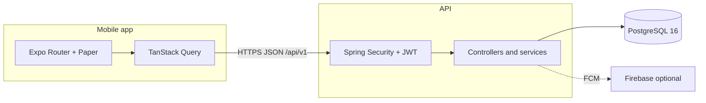

# MowerCare

[](https://github.com/alvarorg14/mowercare/actions/workflows/ci.yml)
[](LICENSE)
[](https://openjdk.org/)
[](https://spring.io/projects/spring-boot)
[](https://expo.dev/)
[](https://reactnative.dev/)
[](https://www.postgresql.org/)
[](CONTRIBUTING.md)

**Service management for robotic lawn mower installations** — issue tracking, notifications, and operational workflows for field teams.

MowerCare is a **multi-tenant** B2B product: organizations manage work through a **Spring Boot** API and an **Expo / React Native** mobile app. Access is **employee-only** (no public self-registration); see [Employee-only access](docs/employee-only-access.md).

## Features

- **Multi-tenant issue tracking** — create, filter, sort, assign, and track history per organization
- **Role-based access** — Admin vs Technician with API-enforced permissions ([RBAC matrix](docs/rbac-matrix.md))
- **In-app notifications** — inbox with read state, tied to issue lifecycle events
- **Push notifications** — optional Firebase Cloud Messaging (FCM) when enabled server-side
- **Secure auth** — JWT access tokens, opaque refresh tokens with rotation, tenant-scoped URLs aligned to JWT claims

## Architecture overview



For diagrams, layers, and boundaries, see **[docs/architecture.md](docs/architecture.md)**.

## Tech stack

| Layer | Technologies |
|--------|--------------|
| **API** | Spring Boot 4.0.5, Java 25, Spring Web MVC, Spring Data JPA, Spring Security + OAuth2 Resource Server (JWT), Bean Validation, Liquibase, PostgreSQL driver, springdoc OpenAPI, Firebase Admin (optional push), Testcontainers (tests) |
| **Mobile** | Expo SDK ~55, React 19, React Native 0.83, Expo Router, React Native Paper (MD3), TanStack Query, React Hook Form + Zod, Expo Secure Store / Notifications / Device |
| **Database** | PostgreSQL 16 — schema owned by **Liquibase** (`spring.jpa.hibernate.ddl-auto: none`) |

## Monorepo layout

| Path | Description |
|------|-------------|
| [`apps/api`](apps/api) | Spring Boot API (Maven) — REST, JPA, Liquibase changelogs |
| [`apps/mobile`](apps/mobile) | Expo app — file-based routes under `app/`, shared client under `lib/` |
| [`docs/`](docs) | Project documentation (architecture, API reference, testing, RBAC, …) |
| [`_bmad-output/`](_bmad-output) | Planning and implementation artifacts (BMad methodology) |
| [`.github/workflows/`](.github/workflows) | CI (API `mvn verify`, mobile lint / typecheck / tests / contrast) |
| [`.maestro/`](.maestro) | Maestro E2E flows (local / optional; not default PR CI) |

There is **no** root npm workspace: `apps/api` uses **Maven**; `apps/mobile` uses **npm** with its own `package-lock.json`.

## Prerequisites

- **JDK 25** (API)
- **Maven 3.9+** on your `PATH` (this repo does **not** ship the Maven Wrapper)
- **Node.js 20** (LTS) and **npm** — aligns with [CI](.github/workflows/ci.yml)
- **Docker** when you run **`mvn verify`** or **`mvn test`** in `apps/api` — integration tests use **Testcontainers** (PostgreSQL), same as CI
- **PostgreSQL** reachable when running the API locally (or use Docker Compose under `apps/api`)

## Getting started

### Run the API

From the repository root:

```bash
cd apps/api
mvn spring-boot:run
```

The API expects a PostgreSQL database. Spring Boot reads `SPRING_DATASOURCE_URL`, `SPRING_DATASOURCE_USERNAME`, and `SPRING_DATASOURCE_PASSWORD` from the **process environment** only — it does **not** automatically load a project-root `.env` file. Export variables in your shell, use your IDE run configuration, **direnv**, or another loader. Names are listed in [`.env.example`](.env.example).

You can start PostgreSQL locally with:

```bash
cd apps/api
docker compose up -d
```

Schema changes are applied by **Liquibase** on startup.

### First organization and admin (bootstrap)

On an **empty** database (no organizations), set **`MOWERCARE_BOOTSTRAP_TOKEN`** in the environment (see `.env.example`), then call:

```http
POST /api/v1/bootstrap/organization
X-Bootstrap-Token: <same value as MOWERCARE_BOOTSTRAP_TOKEN>
Content-Type: application/json

{"organizationName":"Your org","adminEmail":"admin@example.com","adminPassword":"min 8 chars"}
```

A second bootstrap returns **409** with Problem Details (`BOOTSTRAP_ALREADY_COMPLETED`). Wrong or missing token → **401** (`BOOTSTRAP_UNAUTHORIZED`). Do not commit real tokens or passwords to git.

### Run the mobile app

```bash
cd apps/mobile
npm ci
npx expo start
```

Use the Expo CLI to open iOS simulator, Android emulator, or web. Configure the API base URL with **`EXPO_PUBLIC_API_BASE_URL`** (see `apps/mobile/lib/config.ts` and `app.config.ts`). Physical devices often need your machine’s LAN IP instead of `localhost`.

## Testing

**Overview:** [docs/testing.md](docs/testing.md)

| Doc | Scope |
|-----|--------|
| [docs/testing-backend.md](docs/testing-backend.md) | API: `mvn verify`, Testcontainers, integration tests |
| [docs/testing-mobile.md](docs/testing-mobile.md) | Mobile: Jest, ESLint, TypeScript |
| [docs/testing-e2e.md](docs/testing-e2e.md) | Maestro UI flows (local; not default PR CI) |

Quick commands:

| Area | Command |
|------|---------|
| API | `cd apps/api && mvn -B verify` |
| Mobile | `cd apps/mobile && npm run lint && npm run typecheck && npm test` |

## CI/CD

Pull requests and pushes to `main` run [`.github/workflows/ci.yml`](.github/workflows/ci.yml):

- **API — verify:** JDK 25, Maven 3.9.9, `mvn -B verify` in `apps/api` (unit + integration with Testcontainers PostgreSQL).
- **Mobile:** `npm ci`, `lint`, `typecheck`, Jest with **informational** coverage summary, `check:contrast`.

**Maestro E2E** is **not** part of the default PR workflow; see [docs/testing-e2e.md](docs/testing-e2e.md).

## Documentation

| Document | Description |
|----------|-------------|
| [docs/architecture.md](docs/architecture.md) | System context, API/mobile layers, ER overview, notification pipeline |
| [docs/api-reference.md](docs/api-reference.md) | HTTP endpoints, request/response shapes, error codes |
| [docs/database-schema.md](docs/database-schema.md) | Tables, columns, FKs, Liquibase index |
| [docs/authentication.md](docs/authentication.md) | JWT, refresh rotation, tenant isolation, RBAC |
| [docs/mobile-architecture.md](docs/mobile-architecture.md) | Expo Router, state, API client, push |
| [docs/developer-guide.md](docs/developer-guide.md) | Local setup, env vars, debugging, common tasks |
| [docs/deployment.md](docs/deployment.md) | Production checklist, Docker, Firebase |
| [docs/adr/](docs/adr/) | Architecture Decision Records |
| [docs/testing.md](docs/testing.md) | Testing hub (CI vs local) |
| [docs/rbac-matrix.md](docs/rbac-matrix.md) | API route permissions |
| [docs/employee-only-access.md](docs/employee-only-access.md) | FR27 access model |
| [docs/account-data-pii.md](docs/account-data-pii.md) | Account / PII notes |
| [docs/mobile-ui-2026.md](docs/mobile-ui-2026.md) | Mobile UI notes |

## Contributing

We welcome contributions. Please read [CONTRIBUTING.md](CONTRIBUTING.md) and [CODE_OF_CONDUCT.md](CODE_OF_CONDUCT.md).

## Security

To report a security issue, see [SECURITY.md](SECURITY.md). Please do **not** open public issues for undisclosed vulnerabilities.

## License

Licensed under the **Apache License 2.0** — see [LICENSE](LICENSE).
