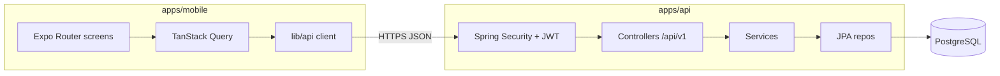

---
stepsCompleted:
  - 1
  - 2
  - 3
  - 4
  - 5
  - 6
  - 7
  - 8
inputDocuments:
  - "_bmad-output/planning-artifacts/prd.md"
  - "_bmad-output/planning-artifacts/product-brief-mowercare.md"
  - "_bmad-output/planning-artifacts/product-brief-mowercare-distillate.md"
  - "_bmad-output/planning-artifacts/prd-validation-report.md"
workflowType: architecture
project_name: mowercare
user_name: Alvaro
date: "2026-03-26"
lastStep: 8
status: complete
completedAt: "2026-03-26"
---

# Architecture Decision Document

_This document builds collaboratively through step-by-step discovery. Sections are appended as we work through each architectural decision together._

## Project Context Analysis

### Requirements Overview

**Functional Requirements:**

The PRD defines **29 FRs** grouped as: **organization & tenancy** (isolate data by org, org profile, one org per user); **authentication** (sign-in/out, deny unauthenticated access); **roles & authorization** (assign roles, enforce permissions for issues and admin); **issue management** (create with required fields, customer/site context, list/detail, update attributes including assignment and status, resolve/close, **history of material changes**); **discovery & triage** (filter/sort); **notifications** (generate for meaningful issue events, deliver to eligible employees by role/rules, in-app surface, push); **user administration** (invite/create, deactivate, block deactivated users); **access model** (employees only, no end-customer accounts in v1); **MVP boundaries** (no billing or third-party integrations required for core flows).

Architecturally, this implies **multi-tenant backend APIs**, a **consistent authorization layer** (tenant + role + issue-level rules), **durable issue storage** with **append-only or auditable change history**, and a **notification subsystem** coupled to issue lifecycle events.

**Non-Functional Requirements:**

**Performance (NFR-P1–P2):** Interactive mobile flows must feel responsive under typical field conditions; exact p95/p99 targets are TBD but must be set before release. Background work must not hide UI state—clear loading/saved/error feedback.

**Reliability (NFR-R1–R3):** Defined uptime for auth, issue I/O, and notification dispatch; high success rate for push under normal conditions with explicit handling of token/permission failures; **no acceptable data loss** for committed issue updates.

**Security (NFR-S1–S5):** TLS in transit; encryption at rest and sound key handling; **tenant isolation enforced in API and data layers** with tests; resilient auth/session design; **auditable** admin and security-relevant actions.

**Privacy (NFR-PR1):** Align processing of personal data in issues and accounts with PRD domain rules (regions, retention, subject rights—details for production).

**Scalability (NFR-SC1–SC2):** Support multiple organizations and tens to hundreds of active users early on; **graceful degradation** under peak/seasonal load (latency, not silent failure).

**Accessibility (NFR-A1):** Baseline mobile accessibility for internal B2B (scaling, contrast, touch targets); stricter WCAG only if required by a customer.

**Integration (NFR-I1):** MVP does not depend on external product integrations.

**Scale & Complexity:**

- **Primary domain:** Full-stack **mobile clients (iOS/Android)** plus **multi-tenant backend** (REST/GraphQL-style API and **real-time or near–real-time** notification path—not necessarily WebSockets for v1, but event-driven delivery is core).
- **Complexity level:** **Medium** — bounded product scope, but **multi-tenancy**, **RBAC**, **notification reliability**, and **field connectivity** add real engineering depth.
- **Estimated architectural components (logical):** **Identity & session service**, **tenant/org service**, **authorization policy**, **issue aggregate + history**, **notification orchestration + device push**, **audit logging**, **mobile app shell** (sync/error UX), plus **shared API contracts** and **observability** across these.

### Technical Constraints & Dependencies

- **Greenfield** product; PRD avoids stack prescription (good for architecture step).
- **MVP excludes web admin and third-party integrations**—reduces surface area; **mobile** is the primary client.
- **Commercial:** Free initial period—**no billing system** in MVP (FR28).
- **Domain:** General field-service / SMB B2B—not a specialized regulated vertical, but **EU/UK-style data protection** may apply depending on deployment and customers; marketing must not over-claim compliance.
- **PRD validation report** recommends resolving: **notification event taxonomy**, **RBAC matrix**, **SLO numbers**—these become explicit architecture and acceptance-criteria inputs.

### Cross-Cutting Concerns Identified

1. **Tenant isolation** — every read/write path must be org-scoped; cross-tenant access is a critical failure mode.
2. **Authorization** — centralized enforcement of role and issue-level rules; alignment between API and mobile.
3. **Issue history & audit** — material changes and admin actions need consistent modeling and storage.
4. **Notifications** — event definition, fan-out, push registration, failure handling, and in-app feed/inbox.
5. **Mobile / connectivity** — predictable behavior when offline or on poor networks (journeys); ties to sync strategy and UX truthfulness.
6. **Observability & operations** — monitoring for core APIs and notification pipeline to meet reliability NFRs.
7. **Privacy & data lifecycle** — retention, export, deletion/anonymization as orgs or sites churn (directional in PRD).

## Starter Template Evaluation

### Primary Technology Domain

**Mobile client (iOS/Android) + JVM API backend with PostgreSQL**, aligned with the PRD (mobile-first MVP, multi-tenant SaaS, issues + notifications + RBAC).

### Starter Options Considered

- **Expo (`create-expo-app`)** — React Native + Expo for field mobile apps, push-capable, TypeScript templates ([create-expo-app](https://docs.expo.dev/more/create-expo/)).
- **Spring Boot (Spring Initializr)** — REST API, Spring Security, JPA, PostgreSQL driver, **Liquibase** for schema changes ([start.spring.io](https://start.spring.io/)).
- **NestJS / Node API** — Deferred in favor of **Spring Boot** per product owner preference.

### Selected Starters

#### 1. Mobile — Expo (`create-expo-app`)

**Rationale:** Mobile-first MVP, push notifications (FR23), single codebase for iOS/Android.

**Initialization** (confirm SDK/template on [create-expo-app](https://docs.expo.dev/more/create-expo/) when you run it):

```bash
npx create-expo-app@latest mowercare-mobile --template blank-typescript
```

```bash
cd mowercare-mobile && npx expo start
```

#### 2. API — Spring Boot + PostgreSQL + Liquibase

**Rationale:** Explicit control over **multi-tenant** domain logic, **RBAC**, and **relational** issue/history modeling; **PostgreSQL** as the system of record; **Liquibase** (not Flyway) for versioned migrations and repeatable environments.

**Recommended Spring Boot dependencies** (select on [start.spring.io](https://start.spring.io/) or equivalent):

| Dependency | Purpose |
|------------|---------|
| **Spring Web** | REST controllers, HTTP layer |
| **Spring Data JPA** | Entities, repositories, transactions |
| **PostgreSQL Driver** | JDBC connectivity to PostgreSQL |
| **Spring Security** | Authentication, authorization hooks |
| **Validation** | Bean Validation (`@Valid`, constraints) on API inputs |
| **Liquibase** | Database migrations (`changelog` files), **no Flyway** |

**Optional (add when needed for first vertical slice):** Spring Boot Actuator (health/metrics), Spring Boot DevTools (local dev), testcontainers (integration tests against PostgreSQL).

**Example — generate via Initializr CLI** (dependency IDs match [start.spring.io](https://start.spring.io/) REST API; pick **Java version** and **Spring Boot** line on the site when generating):

```bash
curl "https://start.spring.io/starter.zip" \
  -d type=maven-project \
  -d language=java \
  -d name=mowercare-api \
  -d artifactId=mowercare-api \
  -d dependencies=web,data-jpa,postgresql,security,validation,liquibase \
  -o mowercare-api.zip
```

Unzip, configure `application.properties` / `application.yaml` with PostgreSQL URL, user, password, and set **`spring.jpa.hibernate.ddl-auto=none`** (or `validate`) so **schema truth** stays in **Liquibase** changelogs.

### Architectural Decisions Provided by Starters

**Expo (`blank-typescript`):** TypeScript, React Native, Expo CLI/Metro; minimal UI — add navigation/design system in implementation stories.

**Spring Boot:** Maven/Gradle layout, `Application` entrypoint, auto-configuration for DataSource + Liquibase; extend with packages for `config`, `security`, `tenant`, `issue`, `notification`, etc.

**Development experience:** `npx expo start` for mobile; `./mvnw spring-boot:run` or Gradle equivalent for API.

**Note:** Running these generators should be an **early implementation story** (two projects or a monorepo — decide in core architectural decisions).

---

### User preferences recorded (Step 3)

- **API:** Spring Boot + **PostgreSQL** + **Liquibase** (explicitly **not** Flyway).
- **Mobile:** Expo / React Native (TypeScript).

## Core Architectural Decisions

### Decision priority analysis

**Critical (block implementation without these):**

- Shared-schema **multi-tenancy** with **`organization_id`** on tenant-owned data.
- **PostgreSQL** + **Liquibase** as the single source of schema truth (`ddl-auto` none/validate).
- **Self-hosted** employee auth + **JWT access + refresh** with explicit **tenant + RBAC** enforcement on every protected path.
- **REST + OpenAPI** contract between mobile and API.
- **UUID** primary keys for org-scoped entities exposed to clients.

**Important (shape the system):**

- **Issue history** via dedicated **audit/history tables**.
- **Problem Details** for API errors.
- **Push** (FCM/APNs via **expo-notifications**); **in-app** activity via **REST** refresh for MVP.
- **Expo Router**, **TanStack Query**, **React Hook Form + Zod**.
- **GitHub Actions** CI/CD; **EAS** for device builds; **managed PostgreSQL** + API on **your primary cloud**.

**Deferred:**

- **Redis** / heavy caching until needed.
- **Edge rate limiting** on auth until traffic or abuse requires it.
- **Full APM/tracing** — start with **structured logging + health**; deepen observability after MVP hardening.

### Data architecture

| Decision | Choice | Rationale |
|----------|--------|-----------|
| Database | **PostgreSQL** | Relational model for orgs, users, issues, history; fits SMB multi-tenant scale. |
| Migrations | **Liquibase** | Versioned, repeatable schema; not Flyway (per product decision). |
| Multi-tenancy | **Shared schema + `organization_id`** | Standard B2B SaaS pattern; enforce in queries and tests (NFR-S3). |
| Issue history | **History / audit table(s)** | Satisfies FR18 without full event-sourcing complexity. |
| Caching | **None initially** | Add Redis only when measured need (sessions, rate limits, hot reads). |
| IDs | **UUIDs** | Stable, safe for APIs and merging; use consistently for org, user, issue references. |
| JPA vs migrations | **Liquibase owns schema** | Hibernate `ddl-auto` **none** or **validate** — no drift from changelogs. |

### Authentication & security

| Decision | Choice | Rationale |
|----------|--------|-----------|
| Auth | **Self-hosted** (Spring Security) | Employee-only accounts; invites/password policies under your control (FR24–FR26). |
| Tokens | **Access JWT + refresh token** | Mobile-friendly; implement rotation/revocation for logout and **deactivated users** (FR26). |
| Authorization | **Spring Security + `@PreAuthorize` + explicit `organizationId` checks** | Defense in depth; avoid cross-tenant bugs (NFR-S3). |
| Secrets | **Environment / secret manager** | No secrets in repo; separate dev/staging/prod. |
| Transport / rest | **TLS** (NFR-S1); encryption at rest via **cloud DB + disk** defaults | Align with PRD security baseline. |

### API & communication patterns

| Decision | Choice | Rationale |
|----------|--------|-----------|
| Style | **REST + JSON** | Natural fit for Spring MVC and mobile clients. |
| Contract | **OpenAPI** | Single source of truth; optional **TypeScript** codegen for the app. |
| Errors | **RFC 7807 Problem Details** | Consistent machine-readable errors; stable `type`/`code` for clients. |
| Push / in-app | **FCM/APNs** for push; **REST** for notification list / issue reads | Meets FR20–FR23 without WebSockets in MVP; add SSE later if needed. |
| Rate limiting | **Deferred** | Document risk; add **Bucket4j** / gateway limits when exposing public auth to abuse. |

### Frontend architecture (Expo)

| Decision | Choice | Rationale |
|----------|--------|-----------|
| Navigation | **Expo Router** | File-based routing, aligned with current Expo defaults. |
| Server state | **TanStack Query** | Retries, staleness, and alignment with flaky field networks (NFR-P2). |
| Forms | **React Hook Form + Zod** | Typed validation aligned with API and OpenAPI. |
| Push | **expo-notifications** | Device registration; backend stores tokens per user/device in org scope. |

### Infrastructure & deployment

| Decision | Choice | Rationale |
|----------|--------|-----------|
| Cloud | **Primary cloud provider** (e.g. **AWS, GCP, Azure**) — **API** on container/VM/App Service + **managed PostgreSQL** | Team’s existing cloud preference; one stack consistently. |
| CI/CD | **GitHub Actions** | Build/test API, run tests, deploy artifacts. |
| Mobile | **EAS Build** + **TestFlight / internal testing** before wide release | Production-grade devices; not relying on Expo Go for pilots. |
| Observability | **Structured logging + Spring Boot Actuator (health/readiness)**; **APM** later | NFR-R1 without over-building day one. |

### Decision impact analysis

**Implementation sequence (suggested):**

1. Spring Boot API skeleton + PostgreSQL + Liquibase baseline + **tenant column convention**.
2. Auth (users, refresh storage, JWT) + **RBAC** + OpenAPI skeleton + Problem Details.
3. Issue aggregate + **history tables** + notification events + device token API.
4. Expo app: Router shell, auth storage, TanStack Query client, issues/notifications screens.
5. EAS + CI deploy to **staging**; TestFlight for pilot.

**Cross-component dependencies:**

- **JWT claims** must include **org id** (or resolvable user→org) for every authorized request.
- **OpenAPI** should drive **Zod** schemas or generated types to reduce drift.
- **Liquibase** migrations must precede JPA features that need new columns.
- **Push** requires **token registration** flow in app + secure storage of tokens per user on API.

## Implementation Patterns & Consistency Rules

### Pattern categories defined

**Critical conflict points (agents could diverge without these rules):** naming (DB, REST, JSON, files), API error shape vs Problem Details, date/time serialization, tenant scoping in code, event names for notifications, logging structure, and where tests live.

### Naming patterns

**Database (PostgreSQL + Liquibase)**

- **Tables:** `snake_case`, **plural** — e.g. `organizations`, `users`, `issues`, `issue_change_events`, `refresh_tokens`.
- **Columns:** `snake_case` — e.g. `organization_id`, `created_at`, `updated_at`.
- **Foreign keys:** `{referenced_table_singular}_id` — e.g. `organization_id`, `assignee_user_id`.
- **Indexes:** `idx_{table}_{columns}` — e.g. `idx_issues_organization_id_status`.
- **Liquibase:** changelog files under `db/changelog/` with **numeric or dated** prefixes; include **context** or labels only if you add conditional migrations later.

**REST API**

- **Base path:** `/api/v1/...` for all versioned HTTP APIs.
- **Resources:** **plural nouns** — `/organizations/{organizationId}/issues`, `/users/me`.
- **Path params:** **camelCase** in OpenAPI — `{organizationId}`, `{issueId}` — must match JSON field casing.
- **Query params:** **camelCase** — `sort`, `status`, `page`, `size` (or `cursor` when pagination is cursor-based).

**JSON (request/response bodies)**

- **Property names:** **camelCase** everywhere (Jackson default + TypeScript clients).
- **Booleans:** JSON `true`/`false` only.
- **IDs:** UUID strings in canonical **8-4-4-4-12** lowercase hex form unless wrapped in a branded type in code.

**Java (backend)**

- **Packages:** by feature — e.g. `com.mowercare.issue`, `com.mowercare.auth`, `com.mowercare.notification`.
- **Classes:** `PascalCase`; methods/fields: `camelCase`.
- **Entity → column:** map to `snake_case` DB columns with `@Column(name = "...")` or a documented naming strategy.

**TypeScript / React (Expo)**

- **Component files:** `PascalCase` for default export components (e.g. `IssueListScreen.tsx`).
- **Route files:** follow **Expo Router** conventions (`app/(tabs)/issues/index.tsx`).
- **Hooks:** `use` prefix — `useIssues`, `useAuth`.
- **Zod schemas:** `{Entity}Schema` — e.g. `IssueCreateSchema`.

### Structure patterns

**Backend**

- **Layering:** `controller` (HTTP) → `service` (use cases) → `repository` (JPA) — **no** DB access from controllers.
- **DTOs:** request/response DTOs separate from JPA entities; **do not** return entities directly if that leaks fields or bypasses serialization control.
- **Tests:** `src/test/java` mirroring `src/main/java`; **integration tests** for repositories with **Testcontainers** PostgreSQL where valuable.

**Mobile**

- **Feature-first** under `app/` (routes) plus **components** under `features/{feature}/` or shared `components/`.
- **API client:** single module (e.g. `lib/api.ts`) with **TanStack Query** hooks per resource.
- **Env:** `app.config` / `expo-constants` for **public** API base URL only; **no** secrets in the repo.

### Format patterns

**Success responses**

- **Direct JSON body** for resources; **no** generic `{ "data": ... }` wrapper unless pagination metadata is added.

**Pagination (when introduced)**

- Document **cursor** or **page/size** in OpenAPI; keep list response shapes consistent.

**Errors (RFC 7807)**

- **`Content-Type: application/problem+json`**
- Fields: at least `type` (URI), `title`, `status`, `detail`, `instance`; add **`code`** (stable machine code) for client branching.
- **Do not** use only ad-hoc `{ message: "..." }` for API errors.

**Dates**

- **API JSON:** **ISO-8601** UTC with `Z` — e.g. `2026-03-26T14:30:00Z`.
- **DB:** `timestamptz` for instants; store UTC.

### Communication patterns

**Domain events (internal)**

- **Past tense, dot-separated** — `issue.created`, `issue.assigned`, `issue.status_changed`.
- **Payload baseline:** `organizationId`, `issueId`, `actorUserId`, `occurredAt` for notifications and audit.

**Notification delivery**

- **Push:** FCM/APNs via **expo-notifications**; server stores **device tokens** per user with **org scope**.
- **In-app:** **TanStack Query** `invalidateQueries` after mutations that affect lists/detail; document **optimistic updates** per feature if used.

### Process patterns

**Loading & errors (mobile)**

- Use **TanStack Query** `isPending` / `isError`; **per-screen** error UI with **retry** (NFR-P2).

**Auth**

- **Access token** in memory; **refresh** in secure storage; **refresh** on 401 once with backoff; **logout** clears storage and query cache.

**Logging (backend)**

- **JSON structured logs** in production; **correlation ID** per request (middleware).
- **Never** log secrets, tokens, or full PII.

### Enforcement guidelines

**All AI agents MUST:**

- Scope **every** tenant-owned read/write by **`organization_id`**; add tests proving **cross-tenant access is denied**.
- Use **Liquibase** for schema changes; **never** rely on Hibernate `ddl-auto` **update** in deployed environments.
- Return **Problem Details** for API errors; align with **OpenAPI** error models.
- Use **camelCase** JSON and **snake_case** DB columns; map explicitly in JPA when needed.
- Use **ISO-8601 UTC** for timestamps in JSON APIs.

**Pattern enforcement**

- **PR checks:** API unit/integration tests; formatting/lint; **OpenAPI diff** when the spec is introduced.
- **Violations:** fix before merge; update this document when patterns change.

### Pattern examples

**Good**

- `GET /api/v1/organizations/{organizationId}/issues?status=open`
- `200` response with JSON objects using camelCase fields.
- `409` Problem Details with `code: "ISSUE_CONCURRENT_MODIFICATION"` if optimistic locking is used.

**Anti-patterns**

- Mixed `snake_case` and `camelCase` in the same JSON payload.
- Trusting **tenant ID** from the URL **without** validating against the JWT **org membership**.
- Returning raw JPA entities with lazy graphs that break serialization or leak fields.

## Project Structure & Boundaries

**Convention:** One repo **`mowercare/`** with **`apps/api`** (Spring Boot) and **`apps/mobile`** (Expo). Planning artifacts stay in **`_bmad-output/`**. Same package boundaries apply if you later rename to `mowercare-api/` and `mowercare-mobile/` at the root.

### 1. Top-level layout

| Path | Purpose |
|------|---------|
| `.github/workflows/` | CI: API tests/build; mobile lint/typecheck (EAS optional) |
| `apps/api/` | Spring Boot HTTP API, JPA, Liquibase |
| `apps/mobile/` | Expo Router app (TypeScript) |
| `docs/` | ADRs, runbooks, optional `project-context.md` |
| `_bmad-output/` | BMAD planning (existing) |
| `README.md` | How to run API + mobile locally |

Root should include **`.gitignore`**, **`.editorconfig`**, and **`.env.example`** (names only, no secrets).

### 2. API application (`apps/api`)

**Build:** `pom.xml` or Gradle at `apps/api/` (one module is enough for MVP).

**Java base package:** `com.mowercare`

**Source (`src/main/java/com/mowercare/`)**

| Package | Owns |
|---------|------|
| `MowercareApplication.java` | Spring Boot entry |
| `common/` | Config, global exception → Problem Details, correlation ID filter, shared security helpers |
| `organization/` | Tenancy + org profile (FR1–FR3) |
| `auth/` | Login, refresh, logout, JWT (FR4–FR6) |
| `user/` | Users, roles, invites, deactivate (FR7–FR10, FR24–FR26) |
| `issue/` | Issues, filters, assignment, history writes (FR11–FR19) |
| `notification/` | In-app + device token registration, dispatch hooks (FR20–FR23) |

**Resources (`src/main/resources/`)**

| Path | Owns |
|------|------|
| `application.yaml` | Profiles, datasource placeholders |
| `application-dev.yaml` | Local overrides (optional) |
| `db/changelog/db.changelog-master.yaml` | Liquibase master |
| `db/changelog/changes/` | Numbered changesets (SQL or YAML) |

**Tests (`src/test/java/`)** — mirror `main` packages; base class with **Testcontainers PostgreSQL** for integration tests.

### 3. Mobile application (`apps/mobile`)

**Tooling:** `package.json`, `app.json`, `eas.json`, `tsconfig.json`

| Area | Path | Owns |
|------|------|------|
| Routes | `app/` | Expo Router: `_layout.tsx`, route groups `(auth)/`, `(app)/` |
| Features | `features/` | Optional per-domain UI + hooks (`issue/`, `notification/`, …) |
| Shared UI | `components/` | Reusable components |
| Clients & schemas | `lib/` | API client, TanStack Query setup, Zod schemas, secure token storage |
| Assets | `assets/` | Images, fonts |

**Rule:** Screens **compose** hooks from `lib/` or `features/`; avoid raw `fetch` in route files except through the shared client.

### 4. Architectural boundaries

**API**

- Public HTTP surface: **`/api/v1/**`** for product REST. Actuator **`/actuator/*`** only as needed and locked down in production.
- **Auth boundary:** JWT validation + Spring Security before controllers; only **auth** routes are unauthenticated (login/refresh).
- **Tenant boundary:** Every use case that reads/writes tenant data receives **`organizationId`** consistent with the JWT (never trust path alone).
- **Persistence boundary:** Controllers → services → JPA repositories; **no** JDBC or repositories in controllers.

**Mobile**

- **Network boundary:** All calls go through **`lib/api`** (or a single module) with TanStack Query.
- **Push boundary:** Registration and permission prompts live in one module (e.g. `lib/notifications.ts`); tokens POST to **`notification`** on the API.

**Data**

- One **PostgreSQL** database; tenant rows carry **`organization_id`**.
- **Liquibase** is the only schema migration path; JPA **`ddl-auto`** is **none** or **validate**.

### 5. Requirements → code mapping (PRD FR groups)

| PRD FR group | API package(s) | Mobile area |
|--------------|----------------|-------------|
| Organization & tenancy (FR1–FR3) | `organization/` | Org context after login (usually implicit in token) |
| Auth (FR4–FR6) | `auth/` | `app/(auth)/`, `lib/auth` |
| Roles (FR7–FR10) | `user/`, `common/security/` | Role-gated screens when you add admin flows |
| Issues (FR11–FR19) | `issue/` | `app/(app)/issues/`, `features/issue/` |
| Notifications (FR20–FR23) | `notification/` | `features/notification/`, notification list tab |
| User admin (FR24–FR26) | `user/` | Admin/settings flows when built |
| Employee-only (FR27) | `auth/` + security | No customer routes |
| No billing / no integrations (FR28–FR29) | omit `billing/`, `integrations/` until scope changes | — |

### 6. Request flow (MVP)



### 7. Monorepo note

If you **do not** use an `apps/` folder, keep the **same packages** inside `mowercare-api/src/main/java/com/mowercare/...` and `mowercare-mobile/...` — only paths at the repo root change.

## Architecture Validation Results

### Coherence validation

**Decision compatibility:** **Pass.** Expo (TypeScript) + Spring Boot + PostgreSQL + Liquibase is a common, proven combination. JWT access + refresh aligns with mobile clients; tenant scoping via `organization_id` matches JPA + PostgreSQL. Problem Details + OpenAPI align with Spring MVC and generated or hand-written TS clients. No contradictory stack choices (e.g. Flyway vs Liquibase resolved: **Liquibase only**).

**Pattern consistency:** **Pass.** Naming rules (DB snake_case, JSON camelCase, REST `/api/v1`, plural resources) match both Spring/Jackson defaults and the mobile stack. Layering (controller → service → repository) matches the chosen packages.

**Structure alignment:** **Pass.** `apps/api` feature packages map to FR groups; `apps/mobile` routes and `lib/` match TanStack Query and Expo Router decisions. Boundaries (auth, tenant, persistence) are explicit.

### Requirements coverage validation

**Epics / stories:** No epics file was used — coverage is by **PRD FR categories** (see Project Structure mapping table). **Pass** for mapped groups.

**Functional requirements (29 FRs):** **Pass** at architecture level. Tenancy (FR1–FR3), auth (FR4–FR6), roles (FR7–FR10), issues (FR11–FR19), notifications (FR20–FR23), admin (FR24–FR26), access model (FR27), MVP boundaries (FR28–FR29) are all assigned to API packages and/or mobile areas. **Fine-grained permission matrix** (which role sees all issues vs assigned-only) remains **product/detail** — implement in `user/` + security, not missing from the architecture.

**Non-functional requirements:** **Pass with follow-ups.** Performance (NFR-P1–P2): mobile responsiveness and non-blocking background work are addressed by TanStack Query + clear UI states; **numeric p95 targets** remain to be set per PRD. Reliability (NFR-R1–R3): transactional issue writes + Liquibase + push pipeline are architecturally supported; **SLO numbers** TBD. Security (NFR-S1–S5): TLS, tenant isolation, JWT, audit hooks are covered; **production key management** is environment-specific. Privacy (NFR-PR1): posture referenced in PRD; **region/retention** is deployment/policy work. Scalability (NFR-SC1–SC2): single DB + app tier fits early scale; **graceful degradation** under load is an implementation/load-test concern.

### Implementation readiness validation

**Decision completeness:** **High.** Stack, auth model, API style, error format, mobile libraries, infra direction, and repo layout are documented. **Spring Boot minor version** is intentionally taken from Spring Initializr at generation time (not frozen in this doc).

**Structure completeness:** **High.** Packages and paths are specified; empty repo today does not block using this as the blueprint.

**Pattern completeness:** **High.** Naming, errors, dates, events, logging, and enforcement bullets are present; optional tooling (OpenAPI diff in CI, Spotless) is named as future enforcement.

### Gap analysis

| Priority | Gap | Impact | Suggested next action |
|----------|-----|--------|------------------------|
| Important | **RBAC matrix** (admin vs technician: global vs assigned issues) | Affects queries and `@PreAuthorize` rules | Lock in story or domain doc before wide build-out |
| Important | **Refresh token** storage (DB table shape, rotation, revocation) | Affects `auth/` schema and logout | Design in first auth story |
| Important | **“Meaningful issue events”** for notifications (FR20) | Affects notification service inputs | Define event enum + mapping in implementation |
| Nice | **Monorepo build** (single CI vs two workflows) | DX only | Choose when both `apps` exist |
| Nice | **OpenAPI codegen** vs hand-written Zod | Consistency vs speed | Decide after first API vertical slice |

**Critical gaps:** **None** identified that prevent starting implementation.

### Validation issues addressed

No blocking contradictions were found between PRD, validation report recommendations, and this architecture. PRD validation **warnings** (NFR numerics, FR20–FR21 wording) are acknowledged; resolution belongs to implementation specs and acceptance tests.

### Architecture completeness checklist

**Requirements analysis**

- [x] Project context analyzed (PRD + briefs + validation report)
- [x] Scale and complexity assessed
- [x] Constraints and cross-cutting concerns mapped

**Architectural decisions**

- [x] Critical decisions documented (stack, auth, API, data, mobile, infra)
- [x] Integration patterns defined (REST, push, internal events)
- [x] Deferred items explicit (Redis, rate limiting, full APM)

**Implementation patterns**

- [x] Naming, format, communication, process patterns documented
- [x] Examples and anti-patterns listed

**Project structure**

- [x] Directory and package layout defined
- [x] FR → structure mapping present
- [x] Boundaries and flow diagram documented

### Architecture readiness assessment

**Overall status:** **READY FOR IMPLEMENTATION**

**Confidence level:** **High** for starting greenfield code; **medium** until SLOs, RBAC details, and notification taxonomy are written into stories/tests.

**Strengths:** Clear tenant model; Liquibase-owned schema; consistent API error strategy; mobile stack aligned with field use and push; structure maps cleanly to FRs.

**Areas for future enhancement:** Redis, rate limiting, WebSockets/SSE for live feeds, monorepo tooling, OpenAPI codegen pipeline, multi-region deployment.

### Implementation handoff

**AI agent guidelines**

- Follow this document for stack, boundaries, and patterns.
- Enforce **organization** scoping and **Problem Details** on errors.
- Keep schema changes in **Liquibase** only.

**First implementation priorities**

1. Generate **`apps/api`** with Spring Initializr (`web`, `data-jpa`, `postgresql`, `security`, `validation`, `liquibase`) and baseline Liquibase changelog + `ddl-auto` none/validate.
2. Generate **`apps/mobile`** with `create-expo-app` (TypeScript template per Expo docs), add Expo Router, TanStack Query, and API base URL config.
3. Implement **auth + tenant context** end-to-end before broad issue features.
4. Add **GitHub Actions** skeleton for API test + mobile lint.

---

_Workflow steps 7–8 (validation + completion) recorded `2026-03-26`._
