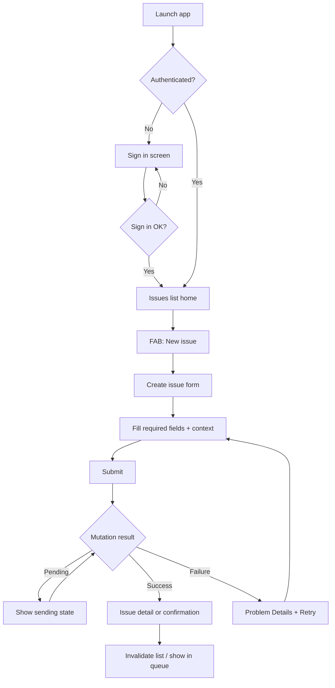
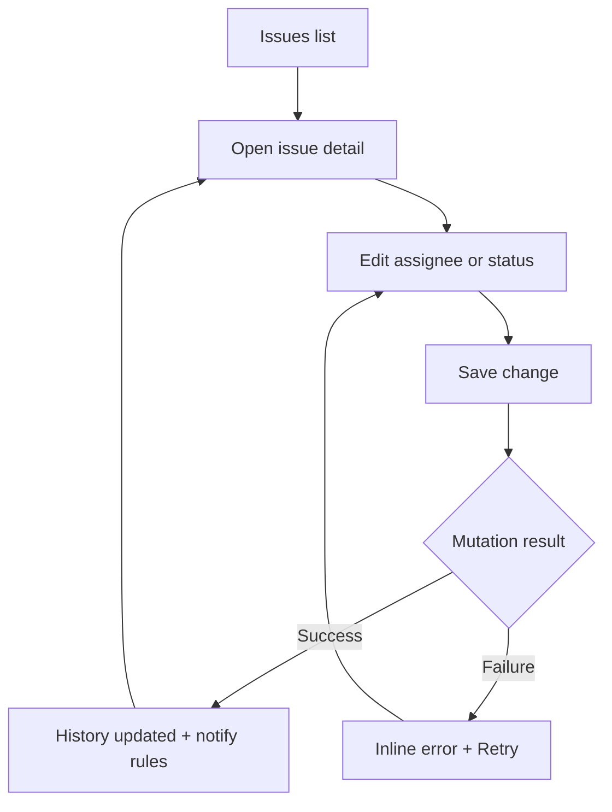
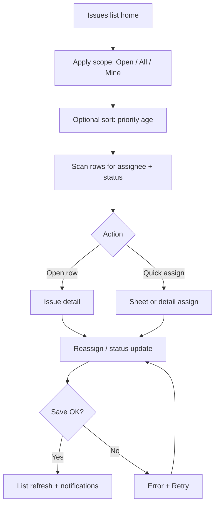
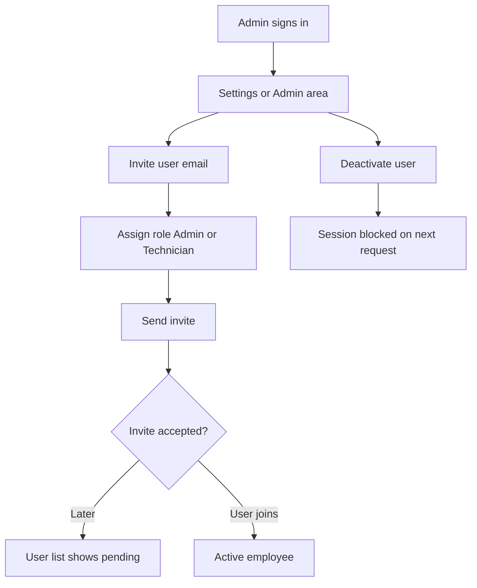

---
stepsCompleted:
  - 1
  - 2
  - 3
  - 4
  - 5
  - 6
  - 7
  - 8
  - 9
  - 10
  - 11
  - 12
  - 13
  - 14
lastStep: 14
workflowStatus: complete
completedAt: "2026-03-26"
inputDocuments:
  - "_bmad-output/planning-artifacts/product-brief-mowercare.md"
  - "_bmad-output/planning-artifacts/product-brief-mowercare-distillate.md"
  - "_bmad-output/planning-artifacts/prd.md"
  - "_bmad-output/planning-artifacts/prd-validation-report.md"
  - "_bmad-output/planning-artifacts/architecture.md"
---

# UX Design Specification mowercare

**Author:** Alvaro
**Date:** 2026-03-26

---

## Executive Summary

### Project Vision

MowerCare v1 replaces fragmented paper-and-chat coordination for authorized mower service teams with a **single, employee-only system of record** for mower issues: **create, triage, assign, and resolve** with **near–real-time notifications** and **role-based access**. UX success means the app is **faster and clearer than informal methods** for the **common field and office paths**, with **trustworthy** behavior on **mobile networks** and **explicit** errors when something fails.

### Target Users

- **Field technicians** need **rapid issue capture** on site, **reliable** updates (including assignment and status), and **confidence** that colleagues see the same truth—especially when connectivity is uneven.
- **Office and dispatch staff** need a **scannable queue**, **filter/sort** for triage, and **assign/reassign** flows that **prevent duplicate effort** and **missed handoffs**.
- **Organization admins** need a **short path** to **employee-only** access: **invites, roles, deactivation**, and assurance that **customer-facing use of MowerCare is out of scope in v1**.

### Key Design Challenges

- **Connectivity and trust:** Surface **clear pending, success, and failure** states for issue actions; align client behavior with **REST + Problem Details** and **TanStack Query** patterns so users never assume an issue is logged when it is not.
- **Roles without complexity:** Express **Admin vs Technician** (and future dispatch nuances) through **navigation, primary actions, and permissions**—consistent with tenant-scoped data and a **to-be-finalized RBAC matrix**.
- **Notifications:** Design **in-app** notification/activity experiences and **push** opt-in flows that match **meaningful issue events** without overwhelming **field** users; depends on locking **event taxonomy** and routing rules.

### Design Opportunities

- **Speed-to-capture:** Optimize the **create-issue** path for **one-handed, on-site** use with **minimal required fields** and **sensible defaults** to beat **paper speed** for typical cases.
- **Shared queue mental model:** Unify technician and office around a **list-first** experience with **strong filtering** so **prioritization** replaces **detective work**.
- **Ownership as a feature:** Make **assignment**, **status**, and **history** **visible and glanceable** so teams **coordinate** instead of **duplicating** visits or **missing** escalations.

## Core User Experience

### Defining Experience

The heart of MowerCare is the **issue loop**: **discover open mower work → create or update issues with correct customer/site context → make ownership and status visible to the team → rely on near–real-time awareness** (in-app and push). The **highest-frequency** actions are **browsing the issue list**, **opening detail**, and **creating or updating** an issue from the field. The interaction that must be **flawless** is **create/update with honest network outcomes**: users must **always** know whether a change is **saved**, **still sending**, or **failed**—so the product remains credible versus paper and chat.

### Platform Strategy

**v1** is **mobile-first** on **iOS and Android** (Expo / React Native per architecture): **touch-optimized**, **phone-primary**, **no product web app** in MVP scope. **Keyboard/mouse** is a **secondary** concern for v1 (e.g. future web admin). **Offline and poor connectivity** are expected in the field: UX must pair with **REST + Problem Details**, **TanStack Query** retries, and clear **per-screen** error and retry patterns—not **silent** loss of work. **Push notifications** and **in-app notification/activity** surfaces are both required: **device permission**, **token failure**, and **disabled push** must be **legible** in the UI.

### Effortless Interactions

- **Fast path to “issue recorded”** — minimal required inputs, **sensible defaults**, and **progressive** detail (add depth after capture when needed).
- **Queue at a glance** — **list-first** navigation; **filter/sort** (status, priority, recency) that supports **triage** without spreadsheet complexity.
- **Ownership without detective work** — **assignment**, **status**, and **history** visible on detail so **handoffs** are explicit.
- **Notification sanity** — alerts tied to **meaningful** lifecycle events; **in-app** feed as the **fallback** when push is off or delayed.

### Critical Success Moments

- **First shared issue** — a new issue appears in the **org queue** and the **right roles** become aware **without** a side channel.
- **Conflict prevention** — **visible assignee** and **status** stop **duplicate** visits or **missed** escalations.
- **Recovery from failure** — a **failed** save or **auth** problem is **clear** and **actionable** (retry, re-login), preserving **trust**.
- **Onboarding completion** — **admin** can **invite** staff and **assign roles** quickly; **technician** completes **first create** in the field without training overload.

### Experience Principles

1. **List before detail** — optimize for **scanning and triage**; depth views support **action**, not browsing.
2. **Honest connectivity** — **never** mask **unsent** or **failed** mutations; align copy and UI with **actual** client and server state.
3. **Field ergonomics** — **large** targets, **short** flows, **readable** outdoors; **one-handed** where realistic.
4. **Least-noise awareness** — **notifications** and **badges** reflect **real** work events; **avoid** alert fatigue in **high-volume** days.
5. **Role clarity** — **Admin** vs **Technician** (and future **dispatch** nuances) differ by **capabilities** and **entry points**, not by **hidden** gestures.

## Desired Emotional Response

### Primary Emotional Goals

Users should feel **in control and professionally grounded**: the queue is **knowable**, ownership is **clear**, and the next action is **obvious**. After logging or triaging work, they should feel **relief and confidence**—**“the team sees what I see”**—rather than the nagging worry that a note or text **did not land**. The feeling worth talking about is **calm competence**: **“we finally run service without dropping threads.”** Differentiation from heavier tools is **lightweight focus** (not toy-like): **fast**, **direct**, **respectful of field reality**.

### Emotional Journey Mapping

- **First launch / onboarding:** **Reassured** and **oriented**—short path to value, no enterprise overwhelm; **clear** that MowerCare is **employee-only** and **org-scoped**.
- **Core daily use (field):** **Focused** and **efficient**—create and update feel **immediate**; **no** ambiguity about **save state**.
- **Core daily use (office):** **In command of the board**—scan, filter, assign **without** hunting across channels.
- **After completing a task:** **Satisfied closure**—issue state and history reflect **what happened**; **notifications** feel **earned**, not noisy.
- **When something goes wrong:** **Safe frustration**—clear **problem**, **next step**, and **retry**; **never** humiliation or “black box” failure.
- **Returning after idle (seasonality):** **Familiar**—same **mental model** (list → detail), **low** re-learning cost.

### Micro-Emotions

**Prioritize:** **Confidence** over confusion; **trust** over skepticism; **accomplishment** over lingering doubt after saves; **connected** (team visibility) over **isolated** (my issue only lives with me).

**Watch closely:** **Anxiety** during **connectivity** stress—mitigate with **honest** states, not spinners alone. **Annoyance** from **notification** volume—mitigate with **meaningful** events and **controls**. **Skepticism** from any **mismatch** between **UI** and **server truth**—treat as a **trust** defect.

### Design Implications

- **Calm competence** → **muted urgency** in default visuals; reserve **strong** emphasis for **priority**, **SLA risk**, or **blocking** states defined in product rules.
- **Trust in persistence** → **explicit** saved / pending / failed; **Problem Details**-aligned **copy**; **retry** always visible on recoverable errors.
- **Shared awareness** → **assignee** and **status** **prominent** on list rows where space allows; **history** readable without **forensics**.
- **Belonging / coordination** → language of **team queue** and **handoff**, not **tickets for bureaucracy**—keep **SMB** tone: **direct**, **human**, **non-corporate** when appropriate.
- **Avoid shame** → errors are **situations** (“Couldn’t save—network”) not **personal failure**; **deactivated** or **auth** states are **matter-of-fact**.

### Emotional Design Principles

1. **Confidence through truth** — never **fake** success; emotional safety follows **technical honesty**.
2. **Calm under load** — **busy day** UX stays **scannable**; **density** serves **triage**, not **stress**.
3. **Quiet pride** — reinforce **“we handled it together”** via **visibility** and **clear ownership**, not gamification.
4. **Respect the field** — **sunlight**, **gloves**, **interruption**—**large** controls, **minimal** ceremony, **forgiving** flows.
5. **Earned alerts** — **notify** when **state** matters to someone else’s **next move**; **reduce** noise to protect **trust** in **every** ping.

## UX Pattern Analysis & Inspiration

### Inspiring Products Analysis

*Reference set used as **pattern proxies** (not yet validated with pilot dealers): products users in similar roles often already know.*

**1. Fast issue / work-tracking UIs (e.g. Linear-style patterns)**  
**Problem solved elegantly:** **Triage** a queue quickly—**status**, **owner**, and **next step** are visible **before** opening an item. **Navigation:** **single** primary **list** with **filters**, not **multiple** competing homes. **Errors:** tend toward **clear** empty states and **recoverable** actions; MowerCare should match **honesty** and **retry**, with **mobile**-appropriate **density** (fewer columns, stronger **typography** hierarchy).

**2. Team awareness / messaging (e.g. Slack-style patterns)**  
**Problem solved elegantly:** **Shared visibility** of **what changed** and **who** should react—without everyone reading everything. **Transferable:** **in-app** activity or **notification** feed as **“what happened to work I care about”**; **not** building **chat**, but **borrowing** **routing** and **signal-to-noise** discipline. **Edge cases:** **muted** or **off** channels → MowerCare: **push** off or **role** rules still leave a **credible** in-app history.

**3. Everyday mobile utilities (e.g. maps, weather, messaging)**  
**Problem solved elegantly:** **Glanceable** information under **sunlight**, **motion**, and **interruption**; **large** controls; **predictable** **back** and **home** behavior. **Messaging** apps reinforce **delivery** metaphors—users **expect** to know if something **left the device** vs **reached the server**; aligns with **honest connectivity** and **Problem Details**-backed copy.

### Transferable UX Patterns

**Navigation**  
- **Single primary queue** (issues list) with **tab** or **filter** for **open / mine / all** (exact labels per RBAC)—mirrors **one home** in successful triage tools.  
- **FAB or prominent primary** “**New issue**” on mobile—mirrors **compose** in mail/chat **without** hiding **behind** menus.

**Interaction**  
- **Row-level** **assignee** + **status** + **age** or **priority** chip—reduces **open-everything** behavior.  
- **Swipe** or **sheet** actions for **assign** / **status** where appropriate—**speed** for **field** (validate in implementation).  
- **Inline** **failure** + **Retry** on **mutations**—like **failed message** patterns, not **silent** drop.

**Visual**  
- **Neutral** surface, **one** accent for **primary** actions and **priority**—supports **calm competence** (Desired Emotional Response).  
- **Typography** scales for **outdoor**; avoid **low-contrast** “pretty” grays for **status** text.

### Anti-Patterns to Avoid

- **Enterprise ITSM first** — **long** create wizards, **mandatory** fields that belong in **defaults**, **config** before **value**; fights **“faster than paper.”**  
- **Notification carpet-bombing** — **every** field change **pings** everyone; destroys **trust** and **calm**; conflicts with **earned alerts**.  
- **Chat as the model** — **threads** as the **home**; MowerCare’s job is **issue state**, not **conversation volume** (comments may exist later—still **secondary** to **ownership** and **status**).  
- **Optimistic UI that lies** — showing **saved** before **ack** from server without **pending** state; **violates** emotional **trust** and **honest connectivity**.  
- **Dense data grids** on **phone** — **spreadsheet** **issue** lists **without** mobile **prioritization**; **breaks** **field** use.

### Design Inspiration Strategy

**Adopt**  
- **List-first triage** and **row-level** **ownership** signals from **modern issue** trackers.  
- **Activity** and **notification** **routing** discipline from **team** collaboration patterns (**relevance** over **volume**).  
- **Large** touch, **readable** **hierarchy**, and **delivery-honesty** metaphors from **everyday** **mobile** **utilities** and **messaging**.

**Adapt**  
- **Speed** shortcuts from **desktop**-oriented tools → **bottom** actions, **sheets**, **fewer** **taps**, **role-aware** **defaults**.  
- **“Channels”** metaphor → **filters** / **views** (**open**, **assigned to me**, **org**) **without** **replicating** **Slack’s** **navigation** depth.

**Avoid**  
- **Full** **FSM** / **scheduling** / **portal** **patterns** in **v1**—scope creep and **UX** **weight**.  
- **Gamification** or **playful** **consumer** **chrome**—misaligned with **B2B** **field** **professional** **trust**.  
- **Web**-first **data** **density** **on** **mobile**—violates **platform** strategy for **MVP**.

## Design System Foundation

### 1.1 Design System Choice

**Primary UI foundation:** **React Native Paper** (Material Design 3) on **Expo / React Native**, with **React Native** core primitives where a screen needs **non-standard** layout.

**Scope:** Applies to **`apps/mobile`** per architecture; **no** product **web** UI in **MVP**—a future **web** admin could revisit **parallel** systems (e.g. MUI or Chakra) in a **later** phase.

### Rationale for Selection

- **Speed and consistency** — pre-built **screen patterns** (lists, app bars, FABs, dialogs, snackbars) match **list-first** and **honest error** UX goals without **inventing** every control.  
- **Accessibility baseline** — components expose **roles** and **sizes** aligned with **NFR-A1** direction; **field** readability still **validated** with **real devices** and **sunlight** testing.  
- **Theming** — **MD3** **theme** supports **brand** **primary**/**surface**/**error** tokens while staying **calm** and **professional** (Desired Emotional Response).  
- **Team fit** — **one** documented **library** for **implementation** stories; **reduces** **one-off** **UI** **drift** across **issue list**, **detail**, **notifications**, **auth**.  
- **Ecosystem** — **widely** used with **Expo**; **lower** **risk** than an **immature** or **highly** **custom** stack at **MVP**.

**Trade-off accepted:** **Visual** **distinctiveness** is **moderate** vs **fully** **custom**; differentiation comes from **issue** **domain** **UX**, **copy**, and **workflow**—not **novel** **chrome**.

### Implementation Approach

- Wrap the app with **Paper**’s **Provider** at the **root** layout (alongside **query** client and **auth** context).  
- Define a **single** **theme** object: **colors** (primary, surfaces, **status** **semantic** colors for issue states), **typography** scales (**outdoor**-friendly minimum sizes), **roundness**, **elevation** usage **sparingly** for **field** clarity.  
- Use **Paper** **components** for **lists** (**List**, **Card**, **Divider**), **forms** (**TextInput**, **HelperText**), **feedback** (**Snackbar**, **Banner**, **ActivityIndicator**), **navigation** affordances (**Appbar**, **FAB**, **IconButton**).  
- Align **mutation** **feedback** with **TanStack Query** + **Problem Details**: **snackbar** or **inline** **error** + **retry**, not **generic** **alerts** only.  
- **Icons:** **@expo/vector-icons** / **MaterialCommunityIcons** consistent with **Paper**.

### Customization Strategy

- **Brand:** set **primary** and **secondary** from **dealer-neutral** **professional** **palette** (greens acceptable as **accent** only if aligned with **brand**—avoid **“toy”** **bright** **defaults**).  
- **Semantic** **colors** for **issue** **status** and **priority** — **map** to **theme** **extensions** or **token** **wrappers** so **list** **rows** stay **consistent**.  
- **Custom** **components** where **Paper** does not fit: e.g. **dense** **issue** **row** with **assignee** **avatar**/**initials**, **status** **chip**, **priority** **badge** — built as **composed** **primitives** **on** **Paper** **tokens**.  
- **Avoid** **forking** **Paper** **internals**; **prefer** **theme** **override** and **composition**.  
- **Revisit** post-MVP: if **web** **admin** ships, **evaluate** a **shared** **token** **layer** (e.g. **Style Dictionary**) so **mobile** and **web** **stay** **aligned** **without** **blocking** **v1**.

## 2. Core User Experience

### 2.1 Defining Experience

The **defining experience** for MowerCare is: **capture a mower issue in the field (or triage it in the office) such that it becomes everyone’s shared, trusted work item**—with **clear ownership** and **honest** **save**/**notify** outcomes.

In **one sentence users might repeat:** **“I logged it, assigned it, and the shop knew—without chasing anyone.”**  
If we nail **fast, truthful create/update** on the **issue queue**, **notifications** and **admin** flows **inherit** credibility; if we fail here, nothing else matters.

### 2.2 User Mental Model

**Today:** **Paper**, **texts**, and **calls** create **private** **truths**—**not everyone** sees the **same** **state**, and **handoffs** **fail** **silently**.

**Mental model to support:** A **shared team clipboard**—**one** **queue** of **open** **work**, **each** row **owned**, **each** **change** **visible** to **those** **allowed** by **role**. Users **expect** **messaging**-grade **clarity** on **“did this go through?”**—not **database** **jargon**.

**Confusion** **risks:** **Assuming** **saved** when **offline**/**failed**; **not** **knowing** **who** **acts** **next**; **notification** **noise** **masking** **real** **escalations**.

### 2.3 Success Criteria

- **Time-to-capture:** **New** **issue** **created** with **required** **fields** in **under** **a minute** for **typical** **cases** (**baseline** **to** **measure** in **pilot**).  
- **Truthfulness:** **User** **always** **sees** **pending** / **saved** / **failed** for **mutations**; **retry** **path** **obvious**.  
- **Shared visibility:** **New**/**updated** **issue** **appears** in **others’** **queues** **within** **near–real-time** **expectations** (per **NFR**/**product** **rules**).  
- **Ownership:** **Assignee** and **status** **readable** **on** **list** **and** **detail** **without** **drill-down** **forensics**.  
- **Earned** **alerts:** **Notifications** **match** **meaningful** **events** **per** **locked** **taxonomy**—**not** **every** **keystroke**.

### 2.4 Novel UX Patterns

**Mostly established:** **List**/**detail**, **forms**, **filters**, **push**/**in-app** **notifications**—users **already** **understand** **issue** **trackers** and **team** **apps**.

**MowerCare’s** **twist** (not **novel** **for** **novelty’s** **sake**): **Field-first** **honesty** and **SMB** **plain** **language**—**calm** **professional** **tone**, **large** **touch**, **minimal** **wizardry**; **differentiation** is **discipline** and **trust**, **not** a **new** **gesture**.

**Education** **burden:** **Low**—**onboarding** **focuses** on **first** **issue**, **first** **assign**, **notification** **permissions**, **not** **new** **interaction** **grammar**.

### 2.5 Experience Mechanics

**1. Initiation**  
- **Technician:** **Open** **app** → **Issues** **tab** **home** → **FAB** **“New issue”** (or **equivalent** **primary** **CTA**). **Optional** **deep** **link** **from** **push** **opens** **relevant** **issue** **detail**.  
- **Office/dispatch:** **Same** **queue** **home**; **filters** **for** **open**/**priority**/**assigned**.  
- **Admin:** **Reach** **user** **management** **from** **settings**—**secondary** **to** **queue** **for** **daily** **use**.

**2. Interaction**  
- **Create:** **Short** **form**—**required** **fields** **only** **per** **MVP**; **progressive** **disclosure** **for** **notes**/ **context**. **Assign** **and** **status** **per** **RBAC**.  
- **Update:** **Detail** **screen** **with** **primary** **actions** (**status**, **assign**, **comment** **if** **in** **scope**); **list** **may** **offer** **quick** **actions** **where** **validated**.  
- **System:** **TanStack** **Query** **tracks** **mutation** **state**; **API** **returns** **Problem** **Details** **on** **failure**.

**3. Feedback**  
- **Pending:** **Non-blocking** **indicator** **on** **submit**; **avoid** **blocking** **entire** **screen** **unless** **necessary**.  
- **Success:** **Confirmation** **via** **updated** **list/detail** + **optional** **snackbar**; **list** **invalidation** **shows** **new** **truth**.  
- **Failure:** **Inline** **or** **snackbar** **with** **plain** **language** **+** **code** **reference** **for** **support**; **Retry** **button**.  
- **Notifications:** **In-app** **feed** **+** **push** **per** **rules**; **empty** **states** **explain** **“no** **issues”** **vs** **“filters** **hid** **everything.”**

**4. Completion**  
- **Create/update** **done** **when** **server** **acknowledged** **and** **UI** **reflects** **new** **state**.  
- **Next** **step:** **return** **to** **queue** **or** **stay** **on** **detail** **for** **another** **edit**—**preserve** **context** **without** **extra** **navigation** **steps** **by** **default**.

## Visual Design Foundation

### Color System

**Direction:** **Neutral, workmanlike** surfaces with **one restrained primary** for primary actions; **avoid** loud “consumer app” saturation. **Emotional fit:** **calm under load**; **urgency** only via **semantic** **priority** and **status**—not **wall-to-wall** **brand** **tint**.

**Baseline (implement via React Native Paper theme + semantic extensions):**

| Role | Intent |
|------|--------|
| **Primary** | Main **FAB**, **primary** **buttons**, **key** **links** — **cool** **blue** or **slate-teal** (exact hex **TBD** with brand); must pass **contrast** on **surfaces**. |
| **Surface / background** | **Light** **mode:** **off-white** or **cool** **gray** **5–8%** for **scrolling** **lists**; **avoid** **pure** **#FFF** **everywhere** to reduce **glare** in **sunlight** (tune on **device**). |
| **Secondary / accents** | **Subtle** **chips**, **filters**—**muted** **outline** **style** **preferred** over **filled** **blocks**. |
| **Semantic — issue status** | **Open** (neutral or **info** **blue**), **in progress** (**amber**/ **warning** **hue**), **blocked/waiting** (**orange** **or** **distinct** **pattern** **TBD**), **resolved/closed** (**success** **green** **muted**). **Map** to **theme** **tokens** **IssueStatus**\* **not** **ad-hoc** **hex** in **screens**. |
| **Semantic — priority** | **Low**/**medium**/**high**/**urgent** — **badge** **colors** **tested** **together** **on** **list** **rows**; **urgent** **never** **only** **red** **text** **without** **icon** ( **color-blind** **safety** ). |
| **Error / warning / success (UI chrome)** | **Error** for **failed** **save**, **auth**; **warning** for **destructive** **confirm**; **success** for **resolved** **transitions**—align **Paper** **defaults** **then** **tweak** **contrast**. |

**Dark mode:** **Defer** **to** **post-MVP** **unless** **pilot** **demands** **it**; **if** **added**, **re-validate** **semantic** **status** **colors** **and** **outdoor** **readability**.

**Accessibility:** **WCAG** **2.1** **AA** **minimum** for **body** **text** **vs** **surface**; **graphical** **objects** **and** **UI** **components** **meet** **contrast** **where** **NFR-A1** **/ customer** **policy** **requires** **stricter** **tiers**.

### Typography System

**Strategy:** Use **React Native Paper**/**MD3** **type** **scale** **first**; **platform** **fonts** (**SF** **Pro** on **iOS**, **Roboto** on **Android**) **for** **native** **familiarity** **and** **performance**.

- **Tone:** **Professional**, **direct**, **not** **marketing**-heavy; **short** **labels** **and** **dense** **lists** **favor** **medium** **weight** **titles** **over** **display** **sizes**.  
- **Reading load:** **Mostly** **labels**, **list** **titles**, **short** **descriptions**—**not** **long-form** **reading**; **still** **use** **≥** **16** **sp** **body** **where** **users** **read** **sentences** (**notes**, **history**).  
- **Hierarchy:** **Title** **(issue** **id** **+** **summary)**, **subtitle** **(site/customer** **line**), **meta** **(time**, **assignee**)—**three** **levels** **max** **on** **list** **rows** **to** **preserve** **scannability**.  
- **Line height / spacing:** **Follow** **Paper** **defaults**; **increase** **lineHeight** **slightly** **for** **multiline** **notes** **if** **wrapped** **on** **small** **phones**.  
- **Optional brand font:** **Only** **if** **provided** **later**—**embed** **with** **performance** **and** **licensing** **checks**; **not** **required** **for** **MVP**.

### Spacing & Layout Foundation

**Density:** **Efficient** **but** **not** **cramped**—**field** **users** **need** **touch** **targets** **and** **breathing** **room** **between** **tappable** **rows**.

- **Base unit:** **8** **dp** **grid** (**Material** **default**); **insets** **16** **dp** **screen** **horizontal** **padding** **typical**.  
- **List rows:** **Min** **height** **~** **56–72** **dp** **inclusive** **of** **touch**; **separate** **rows** **with** **hairline** **divider** **or** **subtle** **surface** **alternate** **(use** **sparingly** **to** **avoid** **zebra** **fatigue**).  
- **Vertical** **rhythm:** **12–16** **dp** **between** **form** **fields**; **group** **related** **fields** **with** **section** **headers**.  
- **Grid:** **Single** **column** **mobile**; **no** **multi-column** **issue** **tables** **on** **phone**.  
- **Elevation:** **Use** **low** **elevation** **for** **FAB** **and** **modals**; **keep** **lists** **flat** **to** **reduce** **visual** **noise** **outdoors**.

**Layout principles**

1. **One** **primary** **column** **per** **screen**; **secondary** **actions** **in** **app** **bar** **or** **overflow**.  
2. **Sticky** **context** **on** **detail** **(issue** **title** **or** **id**) **when** **scrolling** **long** **history**.  
3. **Bottom** **sheets** **for** **assign**/**status** **when** **reducing** **navigation** **depth**—**validate** **in** **implementation**.

### Accessibility Considerations

- **Touch targets:** **Minimum** **44×44** **pt** **interactive** **areas** (**Apple** **HIG**); **align** **with** **NFR-A1** **baseline**.  
- **Text scaling:** **Support** **OS** **font** **scaling**; **test** **list** **truncation** **and** **chip** **wrap** **at** **large** **sizes**.  
- **Contrast:** **Validate** **primary** **button** **text**, **status** **chips**, **and** **error** **text** **against** **backgrounds** **in** **light** **(and** **dark** **if** **shipped**).  
- **Motion:** **Respect** **“Reduce** **motion”** **where** **animations** **are** **added**; **avoid** **motion** **as** **the** **only** **success** **cue**.  
- **Icons + color:** **Pair** **status** **color** **with** **icon** **or** **label**—**never** **color-only** **state**.

## Design Direction Decision

### Design Directions Explored

Eight directions are captured as static HTML frames in `_bmad-output/planning-artifacts/ux-design-directions.html`:

| ID | Theme | Notes |
|----|--------|--------|
| **A** | List + FAB (Paper baseline) | Tabs/filters for **Open / All / Mine**; standard **row** + **chips**; **recommended default** for **MVP**. |
| **B** | Card rows | More **air**; slightly **slower** **scan** for **high volume** days. |
| **C** | Left **status** stripe | Strong **at-a-glance** **state**; **pairs** with **icon+label** **accessibility** strategy. |
| **D** | Compact density | More **issues** per **screen**; **watch** **touch** **targets** and **outdoor** **legibility**. |
| **E** | Minimal monochrome | **Calm**; **relies** on **typography**; **validate** **status** **without** **color-only** cues. |
| **F** | Prominent **filter** chips | Good for **dispatch**-heavy **triage**; **avoid** **crowding** **primary** **list**. |
| **G** | Tabs as **primary** nav | Puts **Issues / Notify / Settings** **front** **center**; **align** with **Expo Router** **groups**. |
| **H** | **Inbox** entry + list | Surfaces **notification** **context** on **home**; **useful** if **in-app** **feed** is **primary**. |

### Chosen Direction

**Primary:** **Direction A** — **Material-style** **list** **first**, **segmented** **filters** or **tabs** for **queue** **scope**, **FAB** **“New issue”**, **status** **chips** **on** **rows**.

**Optional** **later** **or** **pilot** **tweaks:** incorporate **C** (**left** **stripe**) **if** **status** **scan** **tests** **poorly** **outdoors**; incorporate **F** (**chip** **filters**) **if** **dispatch** **needs** **faster** **slice** **switching** **without** **overflow** **menus**.

### Design Rationale

- **Aligns** with **React Native Paper** / **MD3** **and** **implementation** **velocity**.
- **Supports** **list-first** **core** **experience** **and** **Mateo/Lucia** **journeys** **without** **novel** **navigation**.
- **Keeps** **visual** **weight** **calm**; **strong** **accents** **reserved** for **priority** **and** **status** **semantics**.
- **Directions** **D** **and** **E** **inform** **stress** **tests** (**volume**, **accessibility**) **but** **are** **not** **default** **without** **pilot** **evidence**.

### Implementation Approach

- **Ship** **A** **as** **default** **theme** **layout** **in** **`apps/mobile`**: **Issues** **home** **=** **scoped** **list** **+** **FAB**; **filters** **as** **tabs** **or** **horizontal** **scroll** **chips** **per** **Paper** **patterns**.
- **Track** **pilot** **feedback** **on** **scan** **speed** **and** **filter** **discoverability**; **add** **stripe** **(C)** **or** **expanded** **filters** **(F)** **as** **incremental** **enhancements** **with** **measurement**.
- **Map** **G/H** **ideas** **to** **actual** **Expo Router** **structure** (**tabs** **for** **Issues** **vs** **Notifications**) **without** **committing** **to** **duplicate** **homes** **until** **IA** **is** **validated**.

## User Journey Flows

### Field technician — Log new issue on site (Mateo)

**Goal:** Create a **mower issue** at a **customer site** so the **shop** sees it **near–real time** and **notifications** fire **per** **rules**.

**Entry:** App launch → **Issues** home (Direction A) → **FAB** **New issue**. Optional: **push** deep link to **issue detail** (existing issue) — **not** the default **create** path.

**Notes:** **Submit** **must** **surface** **pending/success/failure**; **no** **silent** **drop** on **bad** **network**. **Optional** **draft** **or** **offline** **queue** is **out** **of** **scope** **unless** **product** **adds** **it**—**UX** **still** **shows** **truthful** **state**.

### Field technician — Correct assignment or status (handoff edge)

**Goal:** **Fix** **wrong** **assignee** or **status** **without** **duplicate** **work** **or** **silent** **errors**.

### Office / dispatch — Triage the day (Lucia)

**Goal:** **See** **open** **work**, **sort/filter**, **assign/reassign**, **avoid** **two** **techs** **on** **same** **job**.

### Org admin — Turn the system on (Jordan)

**Goal:** **Employee-only** **access**: **invite** **users**, **set** **roles**, **deactivate** **leavers**; **no** **client** **accounts**.

### Journey Patterns

- **List → detail → primary action** — **consistent** **shell** for **issues**; **admin** **uses** **same** **nav** **pattern** **with** **different** **destinations**.
- **Mutation contract** — **every** **save**: **pending** → **success** **or** **Problem** **Details** **+** **Retry**; **lists** **invalidate** **on** **success**.
- **Scope** **before** **drill-down** — **tabs/chips** **for** **Open/All/Mine** **reduce** **wrong** **context** **errors**.
- **Role-gated** **destinations** — **technician** **may** **not** **see** **admin** **invites**; **hide** **or** **disable** **with** **explanation**.

### Flow Optimization Principles

1. **Minimize** **taps** **to** **first** **saved** **issue** — **required** **fields** **only**; **defaults** **for** **assignee** **where** **policy** **allows**.
2. **Keep** **cognitive** **load** **on** **one** **decision** **per** **screen** — **filters** **OR** **deep** **edit**, **not** **both** **competing** **for** **attention** **without** **need**.
3. **Celebrate** **quietly** — **success** **=** **updated** **truth** **in** **list** **+** **subtle** **snackbar**; **not** **blocking** **modals** **for** **routine** **saves**.
4. **Recover** **without** **blame** — **errors** **name** **the** **situation** **and** **retry**; **never** **imply** **user** **fault**.
5. **Notification-aware** — **after** **actions** **that** **change** **others’** **next** **steps**, **assume** **notify** **rules** **run**; **surface** **in-app** **feed** **for** **auditability**.

## Component Strategy

### Design System Components

**From React Native Paper (baseline):**

| Area | Components |
|------|------------|
| **Chrome** | `Appbar` / `Appbar.Header`, `FAB`, `IconButton`, `Menu`, `Divider` |
| **Lists** | `List.Section`, `List.Item`, `List.Subheader`; pair with `Surface` / `Card` for Direction A |
| **Forms** | `TextInput`, `HelperText`, `Button`, `SegmentedButtons`, `Switch` (if needed) |
| **Feedback** | `Snackbar`, `Banner`, `ActivityIndicator`, `Portal`, `Dialog` |
| **Tags** | `Chip` (filter + status styling via theme) |
| **Navigation** | Expo Router layouts + Paper icons; tabs via router or custom tab bar |

**Rule:** Prefer Paper primitives first; extend via theme and composition.

### Custom Components

#### IssueRow (list item)

**Purpose:** Dense, scannable row for Direction A lists with issue identity, status, assignee, priority, recency.

**Content:** Issue id or short title, site/customer line (per FR), status + priority chips, assignee name or avatar initials, relative time.

**Actions:** Tap row → detail; optional long-press or chevron for quick actions (later).

**States:** Default, pressed, loading (skeleton or inline spinner if row refetch), disabled (no permission).

**Variants:** Compact (Direction D pilot) vs comfortable (default) — toggle via tokenized row height / padding.

**Accessibility:** Row `accessibilityRole="button"` or equivalent for navigation to detail; chips include full status text; touch target ≥ 44 pt.

#### IssueStatusChip / PriorityBadge

**Purpose:** Consistent semantic color + label for issue state and priority (Visual Foundation tokens).

**States:** Default, selected (filter context).

**Accessibility:** Never color-only; icon + text where space allows.

#### AssigneePicker (modal / bottom sheet)

**Purpose:** Pick or reassign org member within RBAC.

**Content:** Searchable list of employees (Paper `List` + `Searchbar`).

**States:** Loading, empty (no users), error (Problem Details).

#### MutationFeedback (inline or banner)

**Purpose:** Unified sending / saved / failed feedback for TanStack Query mutations — aligns with honest connectivity.

**States:** Idle, pending, success (brief), error with Retry.

#### NotificationRow

**Purpose:** In-app activity list (FR22) — issue ref, event type, time, read/unread.

#### EmptyState

**Purpose:** First-run or filtered empty queues — differentiate “no issues” vs “filters too narrow.”

### Component Implementation Strategy

- **Location:** `features/issue/components/`, `features/notifications/`, shared `components/` (EmptyState, MutationFeedback) per architecture paths.
- **Styling:** Paper `useTheme()` for colors/fonts; semantic issue colors via theme extension or small token map.
- **Data:** TanStack Query hooks in `lib/` or feature hooks; no raw `fetch` in presentational components.
- **Forms:** React Hook Form + Zod schemas aligned with OpenAPI (per architecture).

### Implementation Roadmap

**Phase 1 — Core (MVP path)**  
Auth screens (Paper forms + secure storage integration); Issues list + IssueRow + FAB create; Create issue form + MutationFeedback; Issue detail (read + edit status/assignee if in scope).

**Phase 2 — Coordination**  
History / activity timeline on detail; AssigneePicker + refined filters/sort; NotificationRow + in-app notification list screen.

**Phase 3 — Admin & polish**  
User invite / role assignment / deactivate flows; optional Direction C stripe or F chips as measured enhancements; accessibility pass (scaling, contrast, screen reader labels).

## UX Consistency Patterns

### Button Hierarchy

| Level | Use | Paper mapping |
|-------|-----|----------------|
| **Primary** | Single main action on screen (e.g. Save issue, Sign in) | `Button` `mode="contained"` |
| **Secondary** | Alternative that keeps context (e.g. Add note, Assign) | `Button` `mode="outlined"` |
| **Tertiary** | Low-emphasis (e.g. Cancel, Skip for now) | `Button` `mode="text"` or text link in copy |
| **Destructive** | Deactivate user, discard risky change | `Button` with error color + confirm dialog |

**Rules:** One primary per surface (screen or modal); FAB = primary create on Issues home; avoid two contained buttons side by side for equal weight.

### Feedback Patterns

| Situation | Pattern |
|-----------|---------|
| **Success (routine)** | List/detail refresh as source of truth; optional Snackbar 1–2s for mutations |
| **Success (important)** | Short Dialog only if irreversible or first-time milestone (e.g. first invite sent) |
| **Error (recoverable)** | Inline field error or Snackbar with Retry; map Problem Details `code` to copy |
| **Error (session)** | Full-screen or modal “Signed out” with re-auth |
| **Warning** | Banner (dismissible) for degraded mode (e.g. push disabled) |
| **Loading (screen)** | Skeleton or centered ActivityIndicator with label |
| **Loading (inline)** | Row spinner or disabled primary + “Saving…” |

### Form Patterns

- Required fields marked in label or helper; submit disabled only when invalid (not for optional incomplete unless product rule).
- Validation on blur for format; on submit for full schema (Zod).
- Errors tie to field when possible; API errors without field mapping → Snackbar + stable code reference.
- Long text (notes) use multiline `TextInput` with character hint if limits exist.

### Navigation Patterns

- Back returns to list with scroll position preserved where feasible; from create success, land on detail or list per product decision — document once and stick to it.
- Deep links from push open issue detail; invalid id → empty/error state + back to list.
- Admin flows live under Settings or tab; no parallel “home” for admins unless IA changes.

### Additional Patterns

**Empty & loading**  
- First use: short explanation + primary create issue.  
- Filtered empty: “No issues match — clear filters” action.

**Search & filter**  
- Scope tabs or chips for Open / All / Mine; advanced filters in sheet if needed later.

**Modals**  
- Dialog for destructive or irreversible actions; bottom sheet for pickers (assignee, status) when reducing stack depth.

**Notifications**  
- Badge counts on tab or icon — sparingly; in-app list is authoritative for read state when push fails.

**Pull-to-refresh**  
- Optional on lists if native pattern added; must not hide TanStack Query error states.

## Responsive Design & Accessibility

### Responsive Strategy

**MVP scope:** iOS and Android **phones** are the design and engineering target. Layouts stay **single-column**, **touch-first**, **list/detail**, consistent with Direction A.

**Small vs large phones:** Prefer flex and percentage widths; avoid fixed pixel widths for content shells. Test on short (e.g. SE-class) and tall devices; respect safe areas so the FAB does not cover list content.

**Tablets (optional / later):** Same information architecture as phone—wider reading width for detail and notes only. Do not add multi-column issue grids on tablet without explicit product approval (out of MVP scope).

**Desktop / web:** No product web UI in MVP—no web breakpoint deliverables for v1.

**Landscape:** Keep vertical scrolling for lists; do not trap critical paths in horizontal-only layouts without an obvious scroll affordance.

### Breakpoint Strategy

There are **no web breakpoints** for MVP (no product web UI). Use React Native layout (flex, optional `maxWidth` for tablet comfort) and Expo Router / navigation options for headers.

If a future web admin ships, define breakpoint tokens then (e.g. 768 / 1024px) aligned with that web stack.

### Accessibility Strategy

**Target:** WCAG 2.1 **Level AA** for contrast and text scaling where it applies to native apps (per NFR-A1). Commit to formal audits or WCAG claims only when a customer or legal requirement demands it.

**Practices:**

- **Contrast:** Body text and controls meet ~4.5:1 against backgrounds; large text and icons per WCAG where measured.
- **Dynamic type:** Support OS font scaling; no clipped critical labels at large sizes.
- **Touch targets:** Minimum ~44×44 pt for interactive elements (see Visual Foundation).
- **Screen readers:** Label icon-only controls; announce errors and save success when not obvious visually (VoiceOver, TalkBack).
- **Keyboard / focus:** Primarily touch; where hardware keyboard or external switches are used, focus order should match visual order (platform defaults + verification).
- **Motion:** Respect Reduce Motion; pair motion with text/icon state when possible.

### Testing Strategy

**Devices:** Physical iOS and Android handsets on representative OS versions (lock min versions in NFRs).

**Responsive:** Check multiple heights, notches, and safe areas; spot-check rotation where relevant.

**Accessibility:** Manual VoiceOver and TalkBack passes on core flows (create issue, list, detail, error + retry); add automated a11y lint or scans in CI when tooling is in place.

**Regression:** Add snapshot or E2E (e.g. Detox, Maestro) for critical paths when CI matures.

### Implementation Guidelines

- Prefer semantic Paper components; set `accessibilityLabel` on icon-only actions.
- Use theme tokens for colors—no ad hoc hex for text on backgrounds.
- Verify Bold Text and larger Dynamic Type / font scale before release candidates.
- Document minimum supported OS versions and any known accessibility limitations at ship.

---

*UX design workflow complete — 2026-03-26.*
