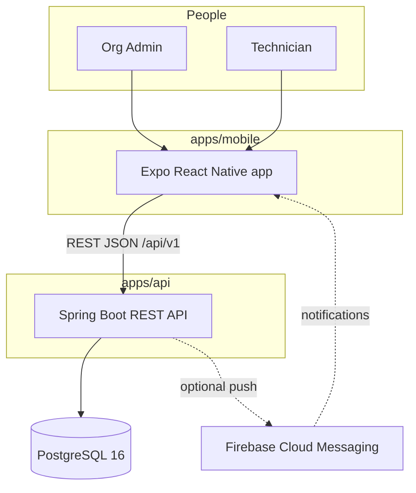
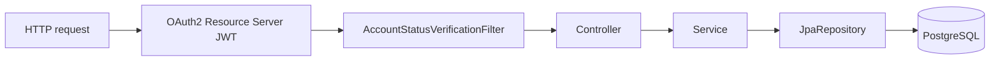
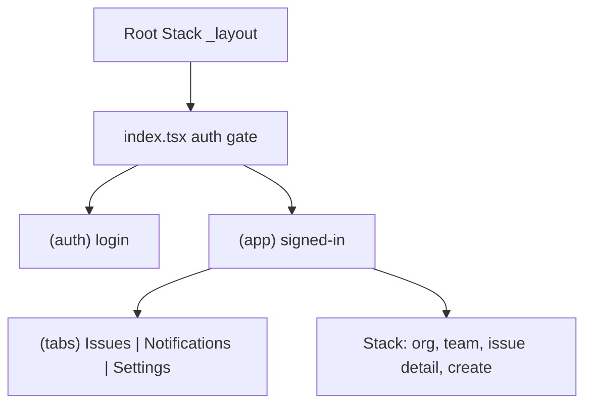
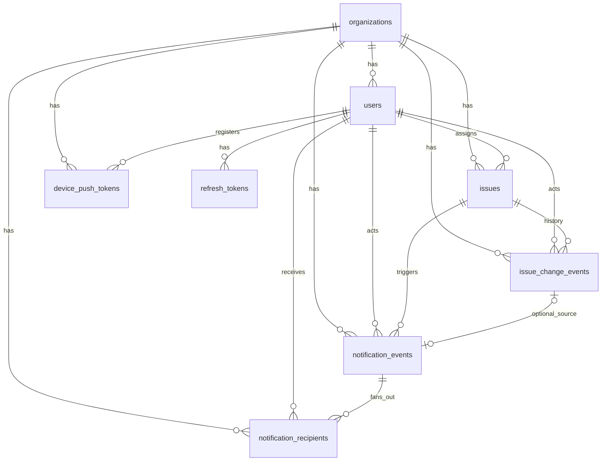
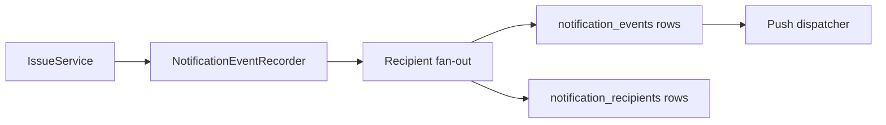

# MowerCare — system architecture

This document describes how the **mobile app**, **HTTP API**, and **PostgreSQL** database fit together. For product-level decisions and pattern rules, see also [`_bmad-output/planning-artifacts/architecture.md`](../_bmad-output/planning-artifacts/architecture.md) (internal planning artifact).

## System overview

MowerCare serves **field service organizations** (admins and technicians). Each **organization** is a tenant: data is isolated with `organization_id` on tenant-owned rows. Clients talk to the API over **HTTPS** with **JWT** bearer tokens; the mobile app uses **Expo** and **React Native**.

## System context

## API request flow

A typical authenticated request passes through Spring Security (JWT resource server), then domain authorization (tenant path + role), then controllers → services → JPA repositories.

- **JWT** validates the access token and builds authentication.
- **AccountStatusVerificationFilter** rejects requests for **deactivated** users (after JWT auth).
- **TenantPathAuthorization** ensures path `organizationId` matches the JWT `organizationId` claim.
- **RoleAuthorization** enforces Admin vs Technician rules per endpoint.

## Mobile navigation (high level)

Routes live under `apps/mobile/app/` (Expo Router). The app uses **TanStack Query** for server state and an **AuthProvider** for session lifecycle.

## Data model (entity relationships)

Schema truth is **Liquibase** (`apps/api/src/main/resources/db/changelog/`). Hibernate does not apply DDL in deployed environments (`ddl-auto: none`).

See [database-schema.md](database-schema.md) for column-level detail.

## Notification pipeline

Issue mutations can emit **notification events**; recipients are materialized per org rules; **FCM** sends push when Firebase is enabled.

In-app delivery is via **GET** notification list APIs; push is optional (`MOWERCARE_FIREBASE_ENABLED`).

## API layer structure

Java packages under `com.mowercare` are **feature-oriented** (e.g. `auth`, `user`, `issue`, `notification`, `organization`, `security`, `common`). HTTP controllers call **services**; services use **repositories** — no DB access from controllers.

Errors use **RFC 7807 Problem Details** (`application/problem+json`) with stable `code` values. See [api-reference.md](api-reference.md).

## Mobile layer structure

- **`app/`** — Expo Router screens and layouts.
- **`components/`** — reusable UI (lists, timelines, pickers).
- **`lib/`** — API client (`api.ts`, `http.ts`), auth (`auth-context.tsx`, `session.ts`, `auth-storage.ts`), domain modules (`issue-api.ts`, …), theme, push helpers.

## Cross-cutting concerns

| Concern | Approach |
|---------|----------|
| **Tenant isolation** | JWT `organizationId` + path checks; integration tests for cross-tenant denial |
| **RBAC** | JWT `role` + explicit checks in controllers/services; [rbac-matrix.md](rbac-matrix.md) |
| **Schema migrations** | Liquibase only — no Hibernate `ddl-auto` updates in prod |
| **API errors** | Problem Details with `urn:mowercare:problem:*` types |
| **Observability** | Structured logging; deepen with Actuator/APM as needed ([deployment.md](deployment.md)) |

## Related documents

- [api-reference.md](api-reference.md) — endpoints and error codes  
- [authentication.md](authentication.md) — tokens, filters, bootstrap  
- [mobile-architecture.md](mobile-architecture.md) — navigation and client layers  
- [developer-guide.md](developer-guide.md) — local development  
