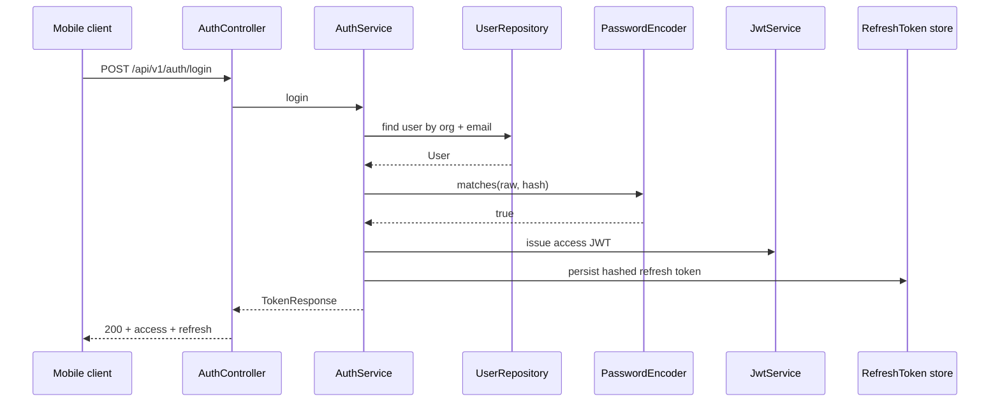
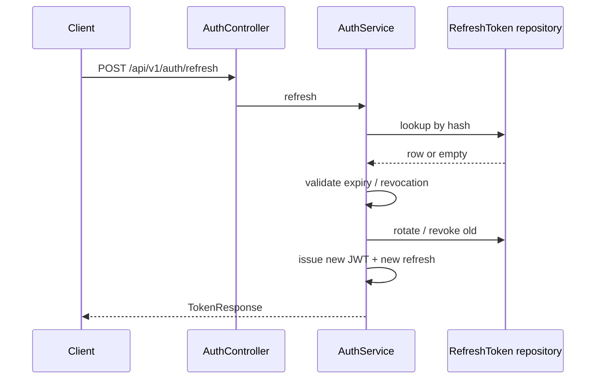
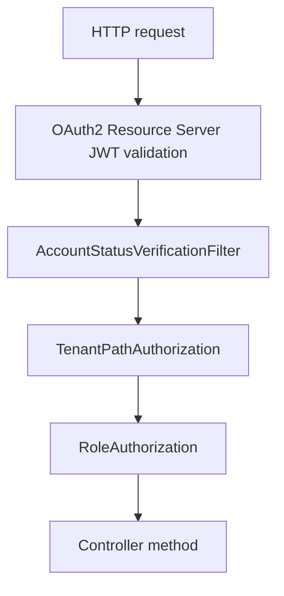

# Authentication and security

MowerCare uses **self-hosted** credentials (email + password per organization). There is **no** public sign-up and **no** SSO in v1 — see [employee-only-access.md](employee-only-access.md).

---

## Login sequence (high level)



---

## Refresh token rotation

Refresh tokens are **opaque** strings stored **hashed** in `refresh_tokens`. On refresh, the API validates the hash, may **rotate** the row, and returns a new access token and refresh token pair.



**Logout** (`POST /api/v1/auth/logout`) revokes the presented refresh token (sets `revoked_at` or equivalent behavior in service layer).

---

## Request authorization flow



1. **JWT** — Spring Security validates the Bearer access token (signature, issuer, expiry) and builds authentication with claims.
2. **AccountStatusVerificationFilter** — After JWT auth, loads the user by `sub` and blocks **deactivated** accounts with **`ACCOUNT_DEACTIVATED`** / related Problem Details.
3. **TenantPathAuthorization** — For routes with `{organizationId}`, ensures the path matches the JWT **`organizationId`** claim. Mismatch → **`403`** `TENANT_ACCESS_DENIED`.
4. **RoleAuthorization** — Enforces **Admin** vs **Technician** per operation (e.g. `requireAdmin` for org profile PATCH). Violation → **`403`** `FORBIDDEN_ROLE`.

Implementation classes live under `com.mowercare.security` (e.g. `SecurityConfig`, `TenantPathAuthorization`, `RoleAuthorization`, `AccountStatusVerificationFilter`).

---

## JWT access token

- **Signing:** HMAC (HS256) via Nimbus; secret from **`MOWERCARE_JWT_SECRET`** (minimum **32 UTF-8 bytes** in production).
- **Issuer:** `MOWERCARE_JWT_ISSUER` (default `https://api.mowercare.local` in `application.yaml`).
- **TTL:** `MOWERCARE_JWT_ACCESS_TTL` (default **PT15M**).
- **Claims (typical):** `sub` = user id, **`organizationId`**, **`role`** (`ADMIN` / `TECHNICIAN`).

Clients send:

```http
Authorization: Bearer <access_jwt>
```

---

## Bootstrap (first organization)

Not JWT-based. **`POST /api/v1/bootstrap/organization`** requires header **`X-Bootstrap-Token`** equal to **`MOWERCARE_BOOTSTRAP_TOKEN`**. Used only when the database has **no** organizations. Errors: `BOOTSTRAP_UNAUTHORIZED`, `BOOTSTRAP_ALREADY_COMPLETED`.

---

## Invites

- Admins create users with optional **`initialPassword`** or invite flow; pending users have **`PENDING_INVITE`** status and stored **invite token hash**.
- **`POST /api/v1/auth/accept-invite`** accepts raw **`token`** + new **`password`** and activates the account.

---

## Environment variables (auth-related)

| Variable | Purpose |
|----------|---------|
| `MOWERCARE_JWT_SECRET` | HMAC secret for access tokens (required in prod) |
| `MOWERCARE_JWT_ISSUER` | JWT `iss` |
| `MOWERCARE_JWT_ACCESS_TTL` | Access token duration (ISO-8601 duration) |
| `MOWERCARE_JWT_REFRESH_TTL` | Refresh token TTL stored server-side |
| `MOWERCARE_BOOTSTRAP_TOKEN` | One-time bootstrap header token |
| `MOWERCARE_INVITE_TOKEN_TTL` | Invite token lifetime (default **P14D**) |

See [`.env.example`](../.env.example) and `apps/api/src/main/resources/application.yaml`.

---

## RBAC

Authoritative route matrix: **[rbac-matrix.md](rbac-matrix.md)** (synced with controllers).

---

## Related documents

- [api-reference.md](api-reference.md) — auth endpoints and error codes  
- [architecture.md](architecture.md) — security in the request path  
- [database-schema.md](database-schema.md) — `users`, `refresh_tokens`  
