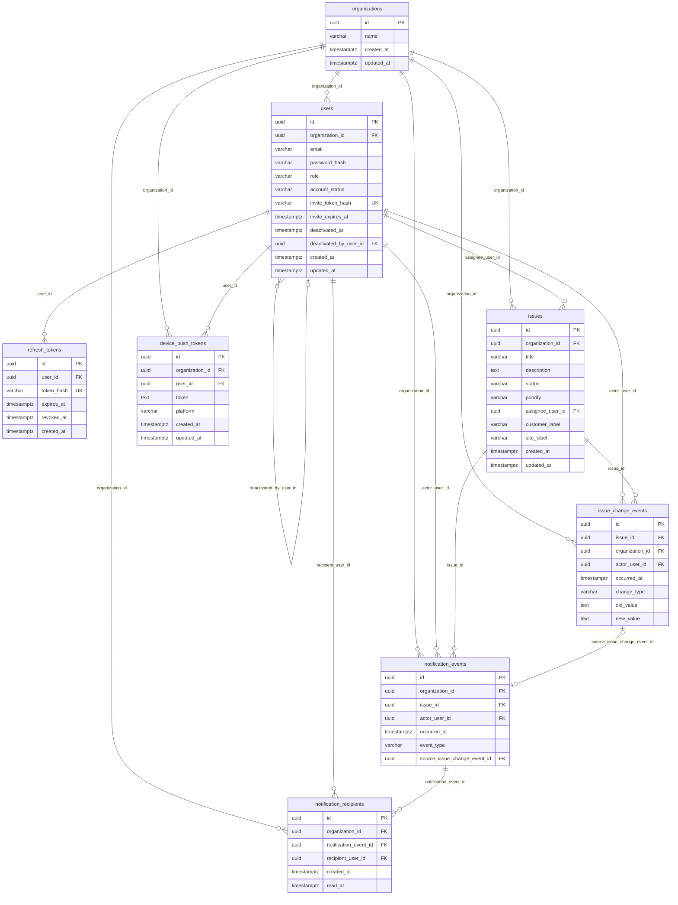
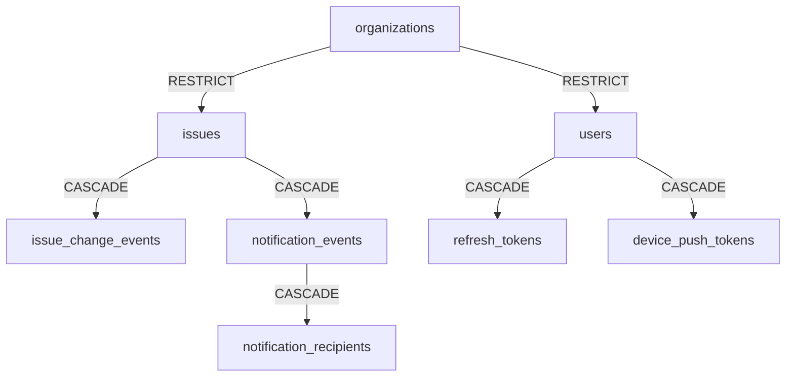

# Database schema

PostgreSQL **16** is the system of record. **Liquibase** owns all DDL; Hibernate is configured with **`spring.jpa.hibernate.ddl-auto: none`**.

- Master changelog: `apps/api/src/main/resources/db/changelog/db.changelog-master.yaml`
- Changesets: `apps/api/src/main/resources/db/changelog/changes/0001-*.yaml` … `0013-*.yaml`

---

## ER diagram (tables and relationships)

---

## Tables

### `organizations`

| Column | Type | Nullable | Notes |
|--------|------|----------|--------|
| `id` | uuid | NOT NULL | PK |
| `name` | varchar(255) | NOT NULL | |
| `created_at` | timestamptz | NOT NULL | |
| `updated_at` | timestamptz | NOT NULL | |

**Entity:** `com.mowercare.organization.Organization`

---

### `users`

| Column | Type | Nullable | Notes |
|--------|------|----------|--------|
| `id` | uuid | NOT NULL | PK |
| `organization_id` | uuid | NOT NULL | FK → `organizations(id)` **ON DELETE RESTRICT** |
| `email` | varchar(255) | NOT NULL | Unique per org: `(organization_id, email)` |
| `password_hash` | varchar(255) | NOT NULL | |
| `role` | varchar(32) | NOT NULL | `UserRole` string |
| `account_status` | varchar(32) | NOT NULL | `AccountStatus`; default `ACTIVE` |
| `invite_token_hash` | varchar(64) | YES | Unique when set |
| `invite_expires_at` | timestamptz | YES | |
| `deactivated_at` | timestamptz | YES | |
| `deactivated_by_user_id` | uuid | YES | FK → `users(id)` **ON DELETE SET NULL** |
| `created_at` | timestamptz | NOT NULL | |
| `updated_at` | timestamptz | NOT NULL | |

**Indexes:** `idx_users_organization_id` on `(organization_id)`.

**Entity:** `com.mowercare.user.User` — `@ManyToOne` to `Organization`; `deactivatedByUserId` stored as scalar UUID (FK exists in DB).

---

### `refresh_tokens`

| Column | Type | Nullable | Notes |
|--------|------|----------|--------|
| `id` | uuid | NOT NULL | PK |
| `user_id` | uuid | NOT NULL | FK → `users(id)` **ON DELETE CASCADE** |
| `token_hash` | varchar(64) | NOT NULL | Unique |
| `expires_at` | timestamptz | NOT NULL | |
| `revoked_at` | timestamptz | YES | |
| `created_at` | timestamptz | NOT NULL | |

**Indexes:** `idx_refresh_tokens_user_id` on `(user_id)`.

**Entity:** `com.mowercare.auth.RefreshToken`

---

### `issues`

| Column | Type | Nullable | Notes |
|--------|------|----------|--------|
| `id` | uuid | NOT NULL | PK |
| `organization_id` | uuid | NOT NULL | FK → `organizations(id)` **ON DELETE RESTRICT** |
| `title` | varchar(500) | NOT NULL | |
| `description` | text | YES | |
| `status` | varchar(32) | NOT NULL | `IssueStatus` |
| `priority` | varchar(32) | NOT NULL | `IssuePriority` |
| `assignee_user_id` | uuid | YES | FK → `users(id)` **ON DELETE SET NULL** |
| `customer_label` | varchar(500) | YES | |
| `site_label` | varchar(500) | YES | |
| `created_at` | timestamptz | NOT NULL | |
| `updated_at` | timestamptz | NOT NULL | |

**Indexes:** `idx_issues_organization_id`, `idx_issues_organization_id_status`, `idx_issues_organization_id_priority`.

**Entity:** `com.mowercare.issue.Issue`

---

### `issue_change_events`

| Column | Type | Nullable | Notes |
|--------|------|----------|--------|
| `id` | uuid | NOT NULL | PK |
| `issue_id` | uuid | NOT NULL | FK → `issues(id)` **ON DELETE CASCADE** |
| `organization_id` | uuid | NOT NULL | FK → `organizations(id)` **ON DELETE RESTRICT** |
| `actor_user_id` | uuid | NOT NULL | FK → `users(id)` **ON DELETE RESTRICT** |
| `occurred_at` | timestamptz | NOT NULL | |
| `change_type` | varchar(64) | NOT NULL | `IssueChangeType` |
| `old_value` | text | YES | |
| `new_value` | text | YES | |

**Indexes:** `idx_issue_change_events_issue_occurred` on `(issue_id, occurred_at)`.

**Entity:** `com.mowercare.issue.IssueChangeEvent`

---

### `notification_events`

| Column | Type | Nullable | Notes |
|--------|------|----------|--------|
| `id` | uuid | NOT NULL | PK |
| `organization_id` | uuid | NOT NULL | FK → `organizations(id)` **ON DELETE RESTRICT** |
| `issue_id` | uuid | NOT NULL | FK → `issues(id)` **ON DELETE CASCADE** |
| `actor_user_id` | uuid | NOT NULL | FK → `users(id)` **ON DELETE RESTRICT** |
| `occurred_at` | timestamptz | NOT NULL | |
| `event_type` | varchar(64) | NOT NULL | Taxonomy string (e.g. `issue.created`) |
| `source_issue_change_event_id` | uuid | YES | FK → `issue_change_events(id)` **ON DELETE SET NULL** |

**Indexes:** `(organization_id, occurred_at DESC)`, `(issue_id, occurred_at)`.

**Entity:** `com.mowercare.notification.NotificationEvent` — `eventType` is a **string** column (not JPA enum name).

---

### `notification_recipients`

| Column | Type | Nullable | Notes |
|--------|------|----------|--------|
| `id` | uuid | NOT NULL | PK |
| `organization_id` | uuid | NOT NULL | FK → `organizations(id)` **ON DELETE RESTRICT** |
| `notification_event_id` | uuid | NOT NULL | FK → `notification_events(id)` **ON DELETE CASCADE** |
| `recipient_user_id` | uuid | NOT NULL | FK → `users(id)` **ON DELETE RESTRICT** |
| `created_at` | timestamptz | NOT NULL | |
| `read_at` | timestamptz | YES | |

**Unique:** `(notification_event_id, recipient_user_id)`.

**Indexes:** `(organization_id, recipient_user_id, created_at DESC)`.

**Entity:** `com.mowercare.notification.NotificationRecipient`

---

### `device_push_tokens`

| Column | Type | Nullable | Notes |
|--------|------|----------|--------|
| `id` | uuid | NOT NULL | PK |
| `organization_id` | uuid | NOT NULL | FK → `organizations(id)` **ON DELETE CASCADE** |
| `user_id` | uuid | NOT NULL | FK → `users(id)` **ON DELETE CASCADE** |
| `token` | text | NOT NULL | |
| `platform` | varchar(16) | NOT NULL | `DevicePushPlatform` |
| `created_at` | timestamptz | NOT NULL | |
| `updated_at` | timestamptz | NOT NULL | |

**Unique:** `(organization_id, user_id, token)`.

**Indexes:** `(organization_id, user_id)`.

**Entity:** `com.mowercare.notification.DevicePushToken`

---

## Enums (Java → DB)

Persisted as **strings** (`@Enumerated(STRING)`) unless noted.

| Enum | Values |
|------|--------|
| `UserRole` | `ADMIN`, `TECHNICIAN` |
| `AccountStatus` | `PENDING_INVITE`, `ACTIVE`, `DEACTIVATED` |
| `IssueStatus` | `OPEN`, `IN_PROGRESS`, `WAITING`, `RESOLVED`, `CLOSED` |
| `IssuePriority` | `LOW`, `MEDIUM`, `HIGH`, `URGENT` |
| `IssueChangeType` | `CREATED`, `STATUS_CHANGED`, `ASSIGNEE_CHANGED`, `PRIORITY_CHANGED`, `TITLE_CHANGED`, `DESCRIPTION_CHANGED`, `CUSTOMER_LABEL_CHANGED`, `SITE_LABEL_CHANGED` |
| `DevicePushPlatform` | `IOS`, `ANDROID`, `UNKNOWN` |

**Notification taxonomy:** `notification_events.event_type` stores **taxonomy strings** such as `issue.created`, `issue.assigned`, `issue.status_changed` (see `NotificationEventType` in code), not necessarily the Java enum constant names.

---

## Delete behavior (high level)

Deleting an **issue** cascades to **issue_change_events** and **notification_events**; **notification_recipients** rows disappear when their **notification_events** parent is deleted. Deleting a **user** cascades **refresh_tokens** and **device_push_tokens**. Deleting an **organization** is blocked by **RESTRICT** while **users**, **issues**, or other org-scoped rows still reference it.

---

## Liquibase migration index

| File | Purpose |
|------|---------|
| `0001-baseline.yaml` | PostgreSQL connectivity check |
| `0002-organizations-and-users.yaml` | `organizations`, `users` |
| `0003-users-credentials-and-role.yaml` | Credentials, role, unique email per org |
| `0004-refresh-tokens.yaml` | `refresh_tokens` |
| `0005-user-account-status-and-invite.yaml` | Account status, invite columns |
| `0006-user-deactivation-audit.yaml` | Deactivation audit columns |
| `0007-deactivated-by-fk-on-delete-set-null.yaml` | `deactivated_by_user_id` FK behavior |
| `0008-issues-and-history.yaml` | `issues`, `issue_change_events` |
| `0009-issues-organization-priority-index.yaml` | Priority index |
| `0010-notification-events.yaml` | `notification_events` |
| `0011-notification-recipients.yaml` | `notification_recipients` |
| `0012-notification-recipients-read-at.yaml` | `read_at` |
| `0013-device-push-tokens.yaml` | `device_push_tokens` |

---

## Conventions

- **Tables:** plural `snake_case` (`organizations`, `issue_change_events`).
- **Columns:** `snake_case`; FKs named `{table}_id`.
- **IDs:** UUID primary keys for tenant-facing entities.
- **Timestamps:** `timestamptz` for instants; store UTC.

See [architecture.md](architecture.md) and [api-reference.md](api-reference.md) for API alignment.
