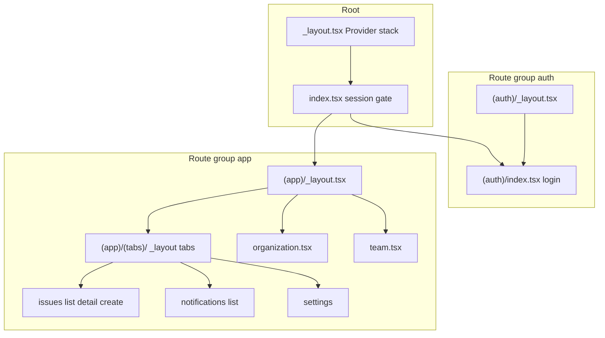
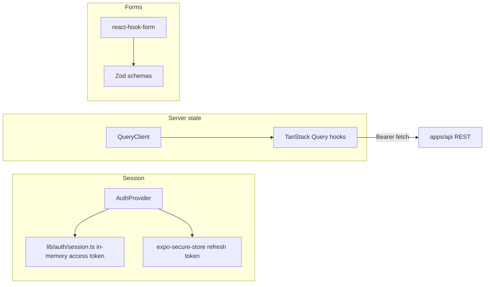
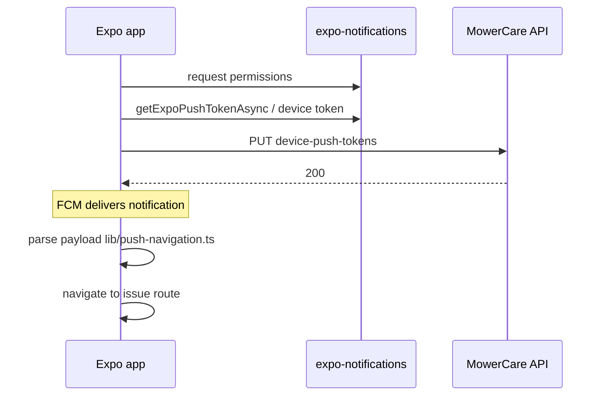

# Mobile app architecture

The client lives in **`apps/mobile`**: **Expo SDK ~55**, **React Native 0.83**, **React 19**, **Expo Router** for navigation, **React Native Paper** for UI, **TanStack Query** for server state.

---

## Navigation tree

- **Auth gate:** `app/index.tsx` waits for session restore, then redirects to `/(app)` or `/(auth)`.
- **Signed-in home:** `app/(app)/index.tsx` redirects to **`/(app)/(tabs)/issues`**.
- **Tabs:** Issues, Notifications, Settings (`app/(app)/(tabs)/_layout.tsx`).
- **Stacks:** Issue list/detail/create under `app/(app)/(tabs)/issues/`; org profile and team as stack screens under `(app)`.

---

## State management

- **Auth:** `AuthProvider` (`lib/auth-context.tsx`) exposes `signIn`, `signOut`, loading flags; **access token** stays in memory (`lib/auth/session.ts`); **refresh token** in **Expo Secure Store** (`lib/auth-storage.ts`).
- **Server data:** **TanStack Query** (`lib/queryClient.ts`) — retries on queries, cache cleared on sign-out.
- **Forms:** **React Hook Form** + **Zod** (`lib/*-schema.ts`, login/org/invite schemas).

---

## Push notification flow (simplified)

Registration and teardown are coordinated with auth lifecycle (register after login; revoke on logout where implemented).

---

## API client

| Module | Role |
|--------|------|
| `lib/config.ts` | Resolve API base URL: `EXPO_PUBLIC_API_BASE_URL`, `expo-constants` `extra.apiBaseUrl`, default localhost |
| `lib/http.ts` | Unauthenticated `fetch`, Problem Details parsing |
| `lib/api.ts` | `authenticatedFetchJson` — attaches Bearer, handles **`AUTH_INVALID_TOKEN`** with refresh + single retry |
| `lib/auth-api.ts` | Login, refresh, logout |
| `lib/issue-api.ts`, `notification-api.ts`, … | Domain calls |

---

## UI and theming

- **React Native Paper** MD3 — theme extended in **`lib/theme.ts`** (greens / outdoor-oriented palette).
- **Issue status colors** — `issueStatusTokens`; CI runs **`npm run check:contrast`** (`scripts/check-issue-theme-contrast.mjs`).

---

## Key `lib/` modules (inventory)

| File / area | Purpose |
|-------------|---------|
| `auth-context.tsx` | Auth React context |
| `auth/session.ts`, `auth-storage.ts` | Tokens |
| `jwt-org.ts` | Read JWT role/org helpers (aligned with API) |
| `queryClient.ts` | TanStack Query defaults |
| `theme.ts` | Paper theme + issue status tokens |
| `push-navigation.ts`, `notifications.ts` | Push wiring |
| `*-api.ts` | REST wrappers per domain |

---

## Related documents

- [architecture.md](architecture.md) — system context  
- [api-reference.md](api-reference.md) — HTTP contract  
- [developer-guide.md](developer-guide.md) — running and debugging the app  
- [mobile-ui-2026.md](mobile-ui-2026.md) — UI notes  
